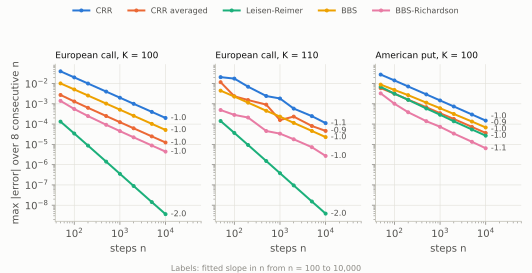
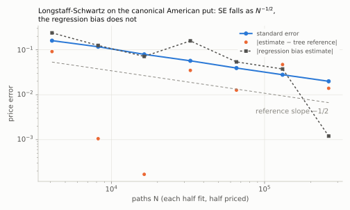
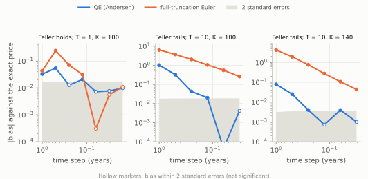

# RiskEngine-CPP — Numerical-method, risk-measure and model risk report

> **Status:** complete: every phase of the plan
> ([`riskengine_research.md`](riskengine_research.md) §12), including the optional model-risk phase
> (Heston and Merton, §8).
>
> **Editorial rules.** Every figure has a self-contained caption (*what it shows*, then *why it
> matters*). Every number points to the CSV or test that produced it. Every stochastic estimate is
> given with its standard error. Every negative claim ("X fails") comes with its mechanism and its
> remedy.

## Executive summary

This report validates a C++20 pricing and risk engine: one model (Black-Scholes-Merton dynamics)
priced by three numerical methods (closed form, binomial trees, Monte Carlo) and used for Greeks
and risk measures, then two alternative models (Heston, Merton) to measure model risk. Every figure
is regenerated from a committed experiment, and every stochastic number carries its error bar. Its
five main findings:

1. **Greeks: the most dangerous failures are the silent ones (§6).** On a digital option, the
   pathwise delta converges with complete confidence to the wrong answer: 0 with a standard error
   of 0, against a true delta of 0.0188. Finite differences with independent seeds and a bump that
   is harmless on a closed form (h = 10⁻⁴) make a Monte Carlo delta 6.4 times its true value in
   error, and a gamma 80,000 times. The recommendation matrix of §6.4 picks one estimator per
   payoff type:
   - for a Lipschitz payoff, the pathwise delta and the mixed gamma (0.35 % and 0.82 % error at
     2¹⁶ paths on the at-the-money call);
   - for a payoff with a jump, the likelihood ratio.
2. **Risk measures: the method sets the capital number before any parameter is estimated
   (§7).** On a delta-hedged short straddle, the one-day 99 % VaR is:
   - 0 by delta-normal;
   - 0.361 by delta-gamma normal (41 % short);
   - 0.613 [0.609, 0.616] by full revaluation;
   - 1.306 [1.301, 1.313] once implied vol is a risk factor.

   Over 34 years of NASDAQ and VIX data, the model-based methods are in the Basel red zone in
   every 250-day window. Historical simulation passes coverage on average (1.35 % exceptions),
   but its exceptions cluster in crises (Christoffersen p = 3 × 10⁻⁵). Replayed crises cost up to
   11 times the historical VaR.
3. **Monte Carlo: mathematics beats hardware (§5, §9).** Control and antithetic variates raise
   efficiency 41× on an at-the-money call and over 1,000× on an in-the-money call and an Asian.
   Perfect scaling on the 4 vCPUs of the test machine would give at most 4× (measured 3.7×).
   Randomized QMC cuts the error of a single estimate by 344× in one dimension, but only by 4.7×
   on a digital of a 12-date average. The coverage of the reported 95 % intervals is 94.5–95.7 %,
   as it should be.
4. **Convergence orders hold only under their assumptions (§3, §4).**
   - The CRR tree's error flips sign between even and odd n (−2.00/n against +1.75/n at the money).
   - Leisen-Reimer is the only second-order tree (3.6 × 10⁻⁹ at n = 10,000). Richardson
     extrapolation of BBS works only for n divisible by 4, and early exercise brings every method
     back to first order.
   - On the closed form itself, a finite-difference gamma below a relative bump of 10⁻⁸ is 100 %
     wrong, and an implied vol backed out of a deep in-the-money quote loses up to 5.7 % to the
     rounding of the quote.

5. **Model risk: one at-the-money price does not identify a model (§8).**
   - Black-Scholes, Heston and Merton are calibrated to the same one-year at-the-money call. Yet
     they disagree by up to 146 % on an 80 put and by 108 % on an up-and-out barrier, while a
     monthly Asian moves by 2 %.
   - A Black-Scholes delta hedge whose error shrinks as the square root of the rebalancing
     interval in its own world stalls, in the Heston and Merton worlds, at a standard deviation of
     2.8–2.9 per option, whatever the frequency. The 99 % ES of the loss is 12–15, more than the
     premium.
   - Under Heston with Feller's condition violated, a full-truncation Euler price at 320 steps is
     still 27 standard errors (2 %) off at the money and 15 % off at K = 140. Andersen's QE scheme
     is within about 2 standard errors from 80 steps.

The engine reproduces every result bit for bit, for any thread count and on GCC and Clang.

---

## 1. Introduction and risk taxonomy

### 1.1 Three kinds of risk in a number

Analytic Black-Scholes, a binomial tree and Monte Carlo under geometric Brownian motion are **one
model and three numerical methods**. That they converge to the same price is a correctness gate,
not a finding. The report studies three distinct sources of error, and never conflates them:

| Risk | Question | Where |
|---|---|---|
| **Numerical-method risk** | For a given model, how fast and how reliably does each method converge, and where does a naive implementation break without warning? | §3–§6 |
| **Risk-measure risk** | For a given position and history, why do two reasonable risk measures give radically different answers? | §7 |
| **Model risk** | What happens when the dynamics themselves change while the vanilla prices stay the same? | §8 |

The guiding principle: **the risk of a number is a property of the number, not of the code.**
- A Monte Carlo price without a standard error is not a result.
- Nor is a Greek without its bias/variance analysis, or a VaR without a confidence interval and
  a backtest.

The engine makes these omissions hard. A stochastic price is an `Estimate` carrying its standard
error, and a stochastic pricer is a pure function of (market, seed), so common random numbers are
automatic. Every figure is the output of a committed experiment whose metadata record the code
version.

### 1.2 Scope: what the report demonstrates and what it does not claim

**Demonstrated**, under GBM with a continuous dividend yield:
- the closed form and its numerical limits (implied vol, finite differences);
- binomial trees for European and American vanillas;
- Monte Carlo with variance reduction and randomized QMC for vanilla, digital and Asian payoffs;
- five Monte Carlo Greek estimators;
- VaR and ES by seven methods on a non-linear book, backtested on 34 years of market data and
  stress-tested on six historical crises.

**Not claimed:**
- **Limited model risk.** Two alternative models (Heston, Merton, §8), calibrated to one
  at-the-money price rather than to a market smile. No local volatility, no stochastic rates.
- **Hypothetical option books.** They are priced from index levels and the VIX, not from
  historical option chains, which are not freely available.
- **Single-machine timings.** The performance figures of §9 belong to one virtual machine.
- **Numerical-method conclusions only.** The report says nothing about which risk model a
  regulator should accept. It shows what each method gets wrong, why, and how to detect it.

---

## 2. Setup, conventions and reproducibility

### 2.1 Dynamics, reference parameters, unit conventions

Units (continuously compounded decimal rates, annualized decimal vol, maturities in years, raw
Greeks per unit of input) and the treatment of degenerate cases are fixed in
[`conventions.md`](conventions.md). The reference vector of this report is S = K = 100, r = 5 %,
q = 0, σ = 20 %, T = 1 year.

### 2.2 Protocol: generator, seeds, efficiency metric, regeneration

**Generator.** Philox 4×32-10, a counter-based generator: call *j* of block *b* is
Philox(key = seed, counter = (j, b, stream)), and its 128 bits give uniforms 2*j* and 2*j* + 1.
There is no state to share or advance. The
implementation is checked at compile time against the Random123 known-answer vectors. Uniforms
are the midpoints (k + ½)·2⁻⁵² of a 2⁵²-point grid: never 0 or 1, and 1 − u is exact. Normals
come from inversion (Wichura AS241, relative error ≤ 10⁻¹⁵ against a 60-digit reference), never
from `std::normal_distribution`, whose algorithm depends on the standard library, nor from
Box-Muller, which destroys the structure of quasi-random points. Because the grid is symmetric,
`normal(1 − u) == −normal(u)` exactly.

**Bit-for-bit reproducibility.** A simulation is cut into a fixed number of blocks, independent of
the thread count. Each block owns its random stream and its Welford accumulator; the partial
results are merged (Chan) in block order. Floating-point addition is not associative, so it is this
fixed order that makes the result bit-identical with 1, 2, 3, 8 or 64 threads. Automatic FMA
contraction is disabled (`-ffp-contract=off`), so GCC and Clang produce the same bits, including
with `-march=native`. So is compile-time evaluation of `exp`, `log`, `erfc` and `pow`
(`-fno-builtin-*`): GCC evaluates them on constants with correctly rounded arithmetic while the
run-time library may differ in the last ulp, so the bits of an expression depended on what the
optimizer happened to inline. This was caught when adding unrelated code to the engine moved the
exact Black-Scholes price recorded by an experiment in its 15th digit, and it changed the
rounding-dominated half of the V-curve of §3.2 (its figure and table are from the fixed build). A Monte Carlo estimate is therefore a pure function of (seed, number of
draws, number of blocks).

**Validation gates (Phase 2)**, all in `tests/test_rng.cpp` and `tests/test_simulation.cpp`, with
fixed seeds (deterministic tests):

| Gate | Result |
|---|---|
| Philox against the Random123 vectors | 3/3, checked by `static_assert` |
| Uniforms: mean, variance, Kolmogorov-Smirnov (10⁶ draws) | within 4 standard deviations; √n·D < 1.95 (99.9 % level) |
| Normals: mean, variance, skewness, kurtosis, Kolmogorov-Smirnov (10⁶ draws) | same |
| Serial (lag-1) and cross-block correlation | < 4/√n |
| Same result with 1/2/3/8/64 threads | exact equality |
| Same result on GCC and Clang | exact equality on golden values |
| Standard-error calibration, 200 independent replications | ≥ 90 % of \|z\| ≤ 1.96, no \|z\| > 4 |

**Efficiency.** Variance-reduction techniques will be compared by
efficiency = 1 / (variance × CPU time) (Glasserman), from Phase 4 on.

**Regeneration.** Every figure or table is produced by an executable in `experiments/`, which
writes `data/results/<id>.csv` and `<id>.meta.json`: git commit and dirty-tree flag, compiler,
configuration, flags, parameters, date. Committed results come from a Release build of a clean tree
(`"git_dirty": false`). Figures are rendered by `tools/make_figures.py`:

```
cmake -S . -B build-release -DCMAKE_BUILD_TYPE=Release
cmake --build build-release --target report   # every experiment, then every figure
```

A full regeneration takes about 5 minutes on the machine of §9. It reproduces every committed CSV
and SVG bit for bit, except the timing and efficiency columns of `mc_efficiency` and
`greeks_matrix` (Appendix D).

---

## 3. Ground truth: analytic Black-Scholes

Every method in the following sections (trees, Monte Carlo, stochastic Greeks) is judged against
the closed form. This section establishes that the closed form itself is exact to the precision
shown, and documents the two numerical limits it already imposes: inversion to implied volatility,
and finite differences.

### 3.1 Validation, invariants, implied volatility

**Reference values.** Ten cases (canonical vector, continuous dividend, Hull's example 15.6, and
two wing strikes whose out-of-the-money price is ~10⁻¹²) are compared with a 50-digit mpmath
reference ([`tools/bs_reference.py`](../tools/bs_reference.py)). The reference Greeks are
*numerical derivatives of the high-precision price*, not the closed forms, so they independently
check the formulas, their signs and the dividend handling. The price and all five Greeks agree to
10⁻⁹ relative in all ten cases, including the 10⁻¹² wing prices (`tests/test_black_scholes.cpp`).

| Canonical vector | Value |
|---|---|
| Call / put | 10.450584 / 5.573526 |
| Call delta | 0.636831 |
| Gamma | 0.018762 |
| Vega | 37.524 per 1.00 of vol (0.375 per point) |
| Call theta | −6.414 per year (−0.01757 per calendar day) |
| Call rho | 53.232 per 1.00 of rate |

**Invariants**, on a 315-point grid (strike 50 to 200 for S = 100, maturity 1 day to 5 years,
vol 5 % to 100 %): put-call parity to 10⁻¹⁴ relative to S + K; no-arbitrage bounds; ∂C/∂K < 0 and
convexity in strike; closed-form Greeks consistent with finite differences of the price. As T → 0
and σ → 0, the pricer returns the discounted forward intrinsic value through an explicit branch,
never through a division by zero; no NaN appears down to T = σ = 10⁻³⁰⁰.

**Implied volatility.** The solver maps the quote to the out-of-the-money option by parity, then
solves log price(σ) = log target with Brent's method on a bracket. Working in log price keeps the
problem well conditioned in the wings, where the price spans hundreds of orders of magnitude.
Newton alone is not used: it diverges where vega → 0.


*Figure 1 — Price → vol → price round trip on the 315-point grid, for the out-of-the-money (blue)
and in-the-money (orange) quote at each point. On the x-axis, the noise bound
ε·(1 + (1 + d²)(a + b)/(σ·vega)), where a − b is the price formula: the relative vol error that
the rounding of the quote causes on its own. **What it shows:** every point lies below the
diagonal; the solver's error never exceeds the noise in the quote, and the in-the-money degradation
tracks that noise exactly. **Why it matters:** an inaccurate implied vol taken from an
in-the-money quote is not a solver defect but information lost in the quote itself; no solver can
recover it.* Source: [`data/results/iv_roundtrip.csv`](../data/results/iv_roundtrip.csv).

| Quote | Solved | Max relative error | Above 10⁻⁹ | Max error / bound |
|---|---|---|---|---|
| Out of the money | 289 / 315 | 1.3 × 10⁻¹³ | 0 | 0.68 |
| In the money | 226 / 315 | 5.7 × 10⁻² | 19 | 0.64 |

The 26 unsolved out-of-the-money quotes have a price that underflows to zero (for example 1 day,
K/S = 2, σ = 5 %): there is no vol to recover. The 89 unsolved in-the-money quotes have a time
value below the rounding of their intrinsic value; the solver reports this (`ZeroTimeValue`)
instead of returning a number. The worst solved case, a put with K = 150, 3 months and σ = 10 %,
recovers the vol to within 5.7 %.

**Mechanism.** A Black-Scholes price is a difference a − b of two terms (for a call,
a = S e^{−qT} N(d₁) and b = K e^{−rT} N(d₂)). In the Gaussian tail the rounding of d is amplified
by a factor d, so each term carries a relative error of about ε·(1 + d²). The quote is therefore
only known to within ε·(1 + d²)·(a + b). Out of the money, a + b stays of the order of the price
and the vol is recovered to ~10⁻¹³. In the money, a + b ≈ S + K while the time value is tiny: the
loss reaches several percent.

**Remedy.** Always invert the out-of-the-money quote; an implied vol taken from a deep in-the-money
quote must come with its noise bound. Jäckel's formulation (*Let's Be Rational*, 2015) remains the
target for reducing the pricer's own share of the error in the wings.

### 3.2 Floating-point rounding and the finite-difference V-curve


*Figure 2 — Absolute error of central-difference delta and gamma on the Black-Scholes price
(canonical vector), against the closed form, for a relative bump h from 10⁻¹⁴ to 10⁻¹. Dashed lines
mark the theoretical optima ε^{1/3} (delta) and ε^{1/4} (gamma). **What it shows:** the error is
V-shaped; on the right, truncation falls as h²; on the left, price rounding grows as ε/h for delta
and ε/h² for gamma. **Why it matters:** a smaller bump does not make a Greek more accurate; below
the optimum it makes it wrong, and for gamma catastrophically so.*
Source: [`data/results/fd_vcurve.csv`](../data/results/fd_vcurve.csv).

In the rounding regime the error at any single h is a noisy draw (it changes sign and can cancel by
luck), so the table gives the median over the seven grid points within ±⅜ of a decade of each h.

| Relative bump h | Delta error | Gamma error (relative) |
|---|---|---|
| 10⁻³ | 8.6 × 10⁻⁷ | 1.2 × 10⁻⁶ |
| 10⁻⁴ | 8.6 × 10⁻⁹ | 2.4 × 10⁻⁸ |
| 10⁻⁵ | 8.1 × 10⁻¹¹ | 1.4 × 10⁻⁶ |
| 10⁻⁶ | 1.1 × 10⁻¹¹ | 1.1 × 10⁻⁴ |
| 10⁻⁸ | 2.0 × 10⁻⁹ | 130 % |
| 10⁻¹⁴ | 9.7 × 10⁻⁴ | 5.6 × 10¹¹ |

The delta error floor is about 10⁻¹¹ for h between 3 × 10⁻⁷ and ε^{1/3} ≈ 6 × 10⁻⁶; the gamma
floor is about 4 × 10⁻¹⁰ (2 × 10⁻⁸ relative) near h ≈ 5 × 10⁻⁵, just below ε^{1/4} ≈ 1.2 × 10⁻⁴.
Isolated downward spikes (for example 4 × 10⁻¹⁵ for delta at h = 2.4 × 10⁻⁶) are sign changes of
the error, not attainable accuracy. From h = 10⁻⁸ down, all 46 grid points give a gamma that is
100 % wrong or worse.

**Mechanism.** For the central difference, the truncation error is ~(h²S²/6)·∂³V/∂S³. The rounding
error is not ε·V: as in §3.1, the price is a difference a − b of two terms that each carry a relative
error of a few ε, so it is only known to ~ε·(a + b) ≈ 2.6 × 10⁻¹⁴ here (a + b ≈ 117 for a price of
10.45). The rounding error is therefore ~ε(a + b)/(hS) for delta and ~ε(a + b)/(hS)² for gamma, and
their sum with the truncation error is smallest at h* ∝ ε^{1/3} and ε^{1/4} respectively. At
h = 10⁻⁵ this predicts a gamma error of 2.6 × 10⁻¹⁴ / 10⁻⁶ ≈ 1.4 × 10⁻⁶ relative, which is what the
table shows. The experiment divides by the step actually realized in floating point, not the intended
one, so that the curve shows only the rounding of the price.

**Remedy.** Use a relative bump, never an absolute one, close to the optimum for the order of the
derivative. A relative bump of 10⁻⁴, a common choice, is safe for both Greeks on a deterministic
pricer. On a Monte Carlo pricer, statistical noise replaces rounding and moves the optimum by
several orders of magnitude: that is the subject of §6.

---

## 4. Trees: convergence and pathologies

A binomial tree prices on a lattice of n steps, by backward induction from the payoff
(`methods/tree/binomial.hpp`). It is exact in the limit n → ∞ and handles American exercise
naturally, which is its reason to exist next to the closed form. Five variants are compared:

- **CRR** (Cox-Ross-Rubinstein): u = e^{σ√Δt}, d = 1/u, risk-neutral p.
- **CRR averaged:** (Vₙ + Vₙ₊₁)/2.
- **Leisen-Reimer (LR):** u, d and p chosen by Peizer-Pratt inversion, so that the tree is
  centred on the strike; odd n only.
- **BBS** (Broadie-Detemple): CRR whose last step is replaced by the Black-Scholes price over
  one step, which smooths the payoff kink.
- **BBS-Richardson:** 2 BBS(n) − BBS(n/2), extrapolating away the 1/n term.

The induction runs in place on one vector (O(n) memory) and takes node spots from precomputed
powers of u and d. Every variant rejects a lattice whose up probability leaves (0, 1), for example
CRR with Δt > σ²/(r − q)²: such a tree prices with negative probabilities. The tests
(`tests/test_trees.cpp`) cover these gates:

- the reference values of the plan (CRR, n = 20,000: European put 5.573426, American put 6.090333);
- put-call parity to 10⁻¹¹;
- the orders of convergence;
- the American invariants below.

Three problems at the canonical market (S = 100, r = 5 %, q = 0, σ = 20 %, T = 1):

- an at-the-money European call, where a node falls on the strike for even n and the strike sits
  midway between two nodes for odd n;
- a European call struck at 110, whose position between nodes moves irregularly with n;
- an at-the-money American put. It has no closed form; its reference, 6.0903710, is
  BBS-Richardson at n = 2¹⁶. Leisen-Reimer at n = 2¹⁶ + 1 agrees to 4.3 × 10⁻⁶, which is its own
  1/n error at that size.

### 4.1 Even/odd oscillations of CRR and their origin


*Figure 3 — n × error of the first-order trees for every n from 10 to 400, for the three problems.
A method converging as c/n draws a flat line at c. **What it shows:** at the money, CRR
alternates between two branches, −2.00 for even n and +1.75 for odd n. At K = 110 it traces
waves between −2.4 and +1.5 that never settle. The American put keeps the two branches of the
at-the-money case. **Why it matters:** the CRR error is O(1/n), but its sign and size depend on
where the strike falls between two nodes. Neither a single n nor even n alone gives the whole
picture.* Source: [`data/results/tree_convergence.csv`](../data/results/tree_convergence.csv).

The terminal payoff is kinked at the strike, and the tree integrates it on a grid of spacing
≈ 2σ√Δt in log-spot. The error therefore depends on the strike's position within its grid cell,
which is a function of n:

- **At the money** (S = K and u d = 1), a node falls exactly on the strike for even n and none
  does for odd n. This gives two smooth branches, both O(1/n) but with constants of opposite sign.
- **Off the money**, the position of ln(K/S) relative to the grid drifts continuously with n, so
  the constant itself oscillates.

Sampling only even n would give a clean slope of −1 and hide half of the behaviour. It is the
plan's warning, confirmed.

Averaging consecutive trees cancels the even/odd part: at the money, n × error falls from ±2 to
−0.12, a 16-fold gain for the price of a second tree. Off the money it only damps the waves to
±0.6, because the oscillation there is not an alternation. **BBS** smooths the kink itself: its
n × error is flat at 0.49–0.51 at the money and 0.21–0.23 at K = 110, a monotone error, the one
property that makes extrapolation possible.

### 4.2 Leisen-Reimer, BBS, Richardson: measured orders



*Figure 4 — Largest absolute error over 8 consecutive valid n from n₀, against n₀, with the slope
fitted from n = 100 to 10,000. The envelope does not depend on where an oscillating error happens
to cross zero. **What it shows:** Leisen-Reimer is the only second-order method on European
options (slope −2.0: 3.6 × 10⁻⁹ at n = 10,000). Richardson on BBS does not reach order 2 in the
envelope, and on the American put every method is first order. **Why it matters:** a
theoretical order holds only under its assumptions: a smooth error expansion for Richardson, a
smooth payoff for Leisen-Reimer.* Source:
[`data/results/tree_convergence_envelope.csv`](../data/results/tree_convergence_envelope.csv).

| Method | Order (slope) | Error at n ≈ 10,000: call K = 100 | Call K = 110 | American put |
|---|---|---|---|---|
| CRR | −1.0 (−1.1 at K = 110) | 2.0 × 10⁻⁴ | 1.1 × 10⁻⁴ | 1.5 × 10⁻⁴ |
| CRR averaged | −1.0 (−0.9 at K = 110) | 1.2 × 10⁻⁵ | 4.6 × 10⁻⁵ | 3.6 × 10⁻⁵ |
| Leisen-Reimer | **−2.0** (−1.0 American) | **3.6 × 10⁻⁹** | **3.9 × 10⁻⁹** | 2.7 × 10⁻⁵ |
| BBS | −1.0 | 5.1 × 10⁻⁵ | 2.3 × 10⁻⁵ | 6.8 × 10⁻⁵ |
| BBS-Richardson | −1.0 (worst case), −2 for n divisible by 4 at the money | 4.4 × 10⁻⁶ | 2.7 × 10⁻⁶ | **6.4 × 10⁻⁶** |

Errors are the envelope at n₀ = 10,000 (max over 8 consecutive valid n).

- **Leisen-Reimer** centres the lattice on the strike for every n, which removes the position
  effect altogether: order 2 on both European calls, with the same constant at and off the money.
- **Richardson needs a smooth expansion.** At the money, the BBS error is 0.510/n for even n but
  0.486/n for odd n. BBS-Richardson combines n with n/2, and when n/2 is odd the two 1/n terms do
  not cancel: a residual of about 0.05/n remains. For n divisible by 4 the extrapolation works (1.6 × 10⁻⁵
  at n = 200, 4.2 × 10⁻⁶ at n = 400, a factor of 4); for n ≡ 2 mod 4 it does not (2.5 × 10⁻⁴ at
  n = 202, 1.2 × 10⁻⁴ at n = 398). At K = 110 the BBS constant drifts slightly with n and the
  extrapolation gains a factor of about 8 over BBS, not an order.
- **Early exercise costs an order.** The exercise boundary adds a kink that moves with time, and
  no lattice is centred on it. Leisen-Reimer falls to first order (−1.0), and BBS-Richardson is
  the most accurate American method (6.4 × 10⁻⁶ at n ≈ 10,000), but it is still first order.

**American invariants** (`tests/test_trees.cpp`, all methods):
- Without dividends, the American call equals the European call bit for bit: the continuation
  value always exceeds the exercise value, so the induction never takes the maximum's other
  branch (Merton's theorem, which holds exactly on the lattice too).
- The American put exceeds the European put, and a deep in-the-money put is worth at least its
  exercise value.
- With an 8 % dividend yield, the American call is worth more than the European one.

The early-exercise premium of the at-the-money put is 6.090371 − 5.573526 = **0.516845**.

**Remedy.** For a European option, use Leisen-Reimer (order 2 with no conditions), or averaged
CRR if a CRR lattice is imposed. Never quote a single CRR price as converged: compare n and
n + 1. For an American option, use BBS-Richardson with n divisible by 4, and estimate the error
from two such n rather than from a theoretical order that no longer holds.

### 4.3 Greeks from the nodes

Delta, gamma and theta come for free from the tree, at no extra induction:

- the tree is rooted two steps before today (Pelsser and Vorst 1994), so that its three step-2
  nodes are S d², S and S u² today;
- centred differences between those nodes give delta and gamma;
- theta compares today's middle node with the root, same spot, two steps earlier.

| Greek (relative error, n = 1000 / 1001) | CRR | BBS |
|---|---|---|
| European call delta | 6.8 × 10⁻⁵ / 2.4 × 10⁻⁵ | 3.8 × 10⁻⁵ / 3.8 × 10⁻⁵ |
| European call gamma | −2.8 × 10⁻⁴ / −7.5 × 10⁻⁴ | −5.9 × 10⁻⁴ / −5.9 × 10⁻⁴ |
| European call theta | −1.7 × 10⁻⁴ / −5.0 × 10⁻⁴ | −3.9 × 10⁻⁴ / −3.9 × 10⁻⁴ |
| American put delta | 1.4 × 10⁻⁴ / 5.4 × 10⁻⁵ | 8.5 × 10⁻⁵ / 8.5 × 10⁻⁵ |
| American put gamma | −1.8 × 10⁻⁴ / −5.8 × 10⁻⁴ | −4.3 × 10⁻⁴ / −4.2 × 10⁻⁴ |
| American put theta | −5.5 × 10⁻⁴ / −1.4 × 10⁻³ | −1.0 × 10⁻³ / −1.0 × 10⁻³ |

References: Black-Scholes for the European call. The American put, which has no closed form, is
measured against the same BBS estimator at n = 2¹⁵, whose own error is about 30 times smaller
than the n = 1000 errors. Source: [`data/results/tree_greeks.csv`](../data/results/tree_greeks.csv),
n = 25 to 5001.

The node Greeks converge at first order and inherit the lattice's behaviour. CRR's gamma and theta
errors change by a factor of about 3 between n = 1000 and n = 1001, while BBS gives the same error
to two digits for both. At n = 1000 every Greek is within 0.14 % of its reference. That is one to two orders of
magnitude better than the Monte Carlo estimators of §6 at 2¹⁶ paths, and it holds for an American
option too, where no closed form exists.

**Remedy.** Read the Greeks of a tree-priced book off an extended tree rather than bumping it.
A bumped tree moves the strike between nodes, so its finite difference picks up the oscillation of
§4.1 (the tree version of the pathology in §3.2). Prefer BBS over CRR for its parity-independent
Greeks.

### 4.4 American exercise by simulation: Longstaff-Schwartz

A tree prices American exercise by backward induction on a lattice; Longstaff and Schwartz (2001)
price it by simulation instead, which matters once the payoff needs more state than a tree can hold
cheaply (a path-dependent feature, several correlated factors). The method
(`methods/montecarlo/longstaff_schwartz.hpp`) simulates N paths, then works backward from maturity:
at each exercise date, it regresses the discounted cash flow each path actually received afterward
on its own spot at that date, restricted to paths currently in the money, and exercises wherever the
fitted continuation value is below the immediate payoff. The basis is {1, S, S²}, the standard
choice in practice (the original paper suggests Laguerre polynomials; the two agree closely near the
money).

Unlike the tree, this needs every path's full trajectory at once — the regression at date k looks
across all N paths simultaneously — so it is O(N × steps) in memory, not O(steps), and lives in its
own class rather than as a mode of the streaming Monte Carlo engine of §5.

**Two sources of error, not one.** A fitted continuation value is only ever an approximation, so
the exercise decision it drives is never better than optimal: this pushes the price down, a bias
that does not shrink with more paths, only with a richer basis. Fitting and pricing the same paths
would compound this with the regression's own look-ahead (it would "know" a path's future when
deciding whether that path's past self should have exercised), so the paths are split in half:
one half fits the exercise boundary, the other, statistically independent, prices along it. The
gap between the in-sample and out-of-sample price is reported as `Estimate::discretization`, kept
separate from `std_error` so the two do not get confused.



*Figure 5 — Longstaff-Schwartz on the canonical American put (K = 100, 50 exercise dates), N from
2¹² to 2¹⁸, against the tree reference of §4 (CRR, n = 20,000, 6.090333). **What it shows:** the
standard error falls as N^(−1/2), the same rate as the European engine of §5, and the actual error
stays inside a few standard errors of the tree at every N. The regression bias estimate does not
trend down with N: it is set by the fixed {1, S, S²} basis, not by how many paths fit it.
**Why it matters:** doubling the path count buys the usual √2 in statistical precision, but not a
smaller systematic bias — that needs a richer basis or more exercise dates, a different knob.*
Source: [`data/results/lsm_convergence.csv`](../data/results/lsm_convergence.csv).

At 2¹⁸ paths, the price is 6.0764 ± 0.0199 against the tree's 6.0904 (the coarser CRR reference of
§4, 6.090333), 0.70 standard errors away and 0.23 % low, consistent with the method's known downward
bias. Two invariants hold across every configuration
tested (`tests/test_longstaff_schwartz.cpp`): the American price never falls below the European one
priced by the closed form of §3, and without dividends an American call matches the European call
within its standard error (Merton's theorem — LSM cannot enforce this exactly the way the tree's
induction does, since it is a statistical estimate, but it must not systematically find spurious
early-exercise value).

**Remedy.** For a vanilla American option in one factor, the tree of §4 is faster and has no
regression bias — use it. Longstaff-Schwartz earns its cost once the tree stops being cheap: more
than one or two state variables (Heston's variance, a path-dependent average), or a payoff a lattice
cannot represent compactly. Report the discretization bias alongside the standard error; a price
without either invites the same mistake §6 makes about Monte Carlo Greeks.

## 5. Monte Carlo: convergence and variance reduction

The engine (`methods/montecarlo/engine.hpp`) simulates any `PathModel` (GBM so far, with an exact
log-space step) for terminal and path-dependent payoffs, discounts, and returns an `Estimate` with its
standard error. Every experiment below uses the canonical market of §2.1 and its closed-form
prices as the truth. The engine's tests hold at 4 standard errors for calls, puts and digitals
with 1 and 12 time steps, and for the straddle and the geometric Asian with 12 steps
(`tests/test_monte_carlo.cpp`).

### 5.1 The N^{−1/2} rate and interval coverage


*Figure 6 — Monte Carlo price of the canonical ATM call with N = 2¹⁰ to 2²² paths (an independent
seed for each N): standard error and actual error against Black-Scholes. **What it shows:** the
standard error falls as N^{−1/2} (fitted slope −0.5004), and the actual error scatters below and
around it, within 1.55 standard errors at every N. **Why it matters:** the rate is the textbook one,
so any faster apparent convergence in later sections has to come from variance reduction, not luck.*
Source: [`data/results/mc_convergence.csv`](../data/results/mc_convergence.csv).

A slope proves the standard error has the right *rate*. It does not prove it has the right *size*.
For that, 1,000 independent pricings (10,000 paths each) of the ATM call and of an out-of-the-money
digital (K = 130) were compared with their exact prices.


*Figure 7 — z-scores (estimate − exact) / SE of 1,000 independent pricings, against the N(0, 1)
density. **What it shows:** 94.5 % (call) and 95.7 % (digital) of the 95 % confidence intervals
contain the exact price, against 95 % ± 0.69 % expected; the z-scores have standard deviation 1.04
and 1.00. **Why it matters:** the error bars reported with every Monte Carlo number in this report
are neither optimistic nor conservative, including for the skewed Bernoulli payoff of a digital.*
Source: [`data/results/mc_coverage.csv`](../data/results/mc_coverage.csv).

### 5.2 Efficiency table, failures included

Techniques are compared by **efficiency = 1 / (variance per path × CPU time per path)**, relative to
plain Monte Carlo on the same payoff. "Variance per path" charges each technique for every path it
simulates (an antithetic pair counts as two). Times are single-threaded, the minimum of three runs,
and include the pilot run that estimates the control-variate coefficient. 10⁶ paths per row.

| Payoff | Technique | Variance per path | ns per path | Efficiency vs plain |
|---|---|---|---|---|
| ATM call | plain | 215.8 | 39.6 | 1 |
| | antithetic | 108.0 | 27.1 | 2.9 |
| | S_T control | 31.5 | 40.1 | 6.8 |
| | antithetic + S_T control | 7.6 | 27.4 | **41** |
| Deep ITM call, K = 70 | plain | 397.4 | 26.3 | 1 |
| | antithetic | 23.1 | 17.8 | 25 |
| | S_T control | 0.98 | 30.1 | 355 |
| | antithetic + S_T control | 0.43 | 20.5 | **1,200** |
| Far OTM call, K = 160 | plain | 3.43 | 26.2 | 1 |
| | antithetic | 3.51 | 17.3 | 1.5 |
| | S_T control | 3.11 | 26.5 | **1.1** |
| ATM straddle | plain | 174.6 | 37.6 | 1 |
| | antithetic | 287.7 | 25.4 | **0.90** |
| Arithmetic Asian, ATM, 12 fixings | plain | 72.4 | 241.4 | 1 |
| | antithetic | 34.8 | 145.8 | 3.4 |
| | geometric control | 0.056 | 297.8 | **1,039** |
| | antithetic + geometric control | 0.061 | 189.4 | 1,511 |

Source: [`data/results/mc_efficiency.csv`](../data/results/mc_efficiency.csv) (timings on the CPU
recorded in its metadata; all estimates are within 2 standard errors of the exact price where one
exists).

**Antithetic variates** pair each path with its reflection Z → −Z. The variance per path becomes
σ²(1 + ρ), where ρ is the correlation between the two halves of a pair. For a payoff monotone in Z,
ρ < 0: the ATM call halves its variance, and the deep ITM call, which is almost linear in S_T, cuts it
17-fold. They also save time: a pair reuses its normals, and the inverse normal is the dominant cost.
**Where they fail:** the ATM straddle |S_T − K| is nearly even in Z, so ρ > 0 and the variance per path
*rises* by 65 %; only the cheaper draws keep the efficiency at 0.90. Far out of the money, almost no
path pays off in either half of a pair, ρ ≈ 0, and the only gain left is the saved draws (1.5×).

**Control variates** subtract β(X − E[X]) with β estimated on an independent pilot run. The variance
falls by a factor 1 − ρ²_YX. The terminal spot is an excellent control for a deep ITM call, which is
nearly S_T − K (355×). **Where it fails:** for the call struck at 160, the payoff is zero on most paths
where S_T varies most, the correlation collapses, and the variance falls by only 9 % (1.1×). The
geometric-average Asian, whose price is known in closed form, is so close to the arithmetic one
that the variance falls by a factor of 1,300 and the efficiency by more than 1,000 even after paying
for the pilot and the extra logarithms.

**Variance reduction beats parallelism.** On this 4-thread machine, perfect parallel scaling would
give at most 4×. The combined techniques give 41× on the ATM call and over 1,000× on the ITM call and
the Asian, from mathematics alone, and they compose with threading since the engine's result is
independent of the thread count.

*Timing note.* The plain ATM call costs 40 ns per path but the deep ITM and far OTM calls only
26 ns, for the same arithmetic: at the money, the branch in max(0, S_T − K) is a coin flip and
mispredicts half the time. This is why efficiencies are only compared within a payoff.

### 5.3 Randomized quasi-Monte Carlo

Quasi-Monte Carlo replaces pseudo-random points with a low-discrepancy sequence: here Sobol points
(Joe-Kuo direction numbers, checked bit for bit against SciPy) with hash-based Owen scrambling.
Scrambling keeps the net structure that makes the points accurate (tested: every one-dimensional
projection and the first two-dimensional one remain exact nets) while making each point uniformly
distributed, so each scrambling gives an unbiased estimate and independent scramblings give an
error bar. Path payoffs can be built by Brownian bridge, which spends the first, best-distributed
coordinates on the terminal value and then the coarse shape of the path.


*Figure 8 — Standard deviation of a single N-point estimate (over 64 independent seeds or
scramblings) against N, for four problems of increasing difficulty; each line is labeled with its
fitted slope. **What it shows:** pseudo-random Monte Carlo converges at N^{−1/2} everywhere;
randomized QMC reaches N^{−1} on the one-dimensional problems, including the digital, drops to
N^{−0.69} (N^{−0.80} with a bridge) on the 12-dimensional Asian, and barely beats N^{−1/2} on a digital of
the 12-dimensional average. **Why it matters:** QMC is not a free speed-up; its gain is set by the
smoothness and effective dimension of the payoff, and it collapses exactly where a risk system needs
it on exotic, discontinuous payoffs.* Source: [`data/results/qmc_convergence.csv`](../data/results/qmc_convergence.csv).

| Problem | Pseudo-random slope | RQMC slope | RQMC + bridge slope | Spread at N = 2¹⁶: pseudo-random → best RQMC |
|---|---|---|---|---|
| ATM call (1-D, kink) | −0.49 | −1.00 | — | 5.0 × 10⁻² → 1.4 × 10⁻⁴ (**344×**) |
| Digital, K = 130 (1-D, jump) | −0.50 | −1.00 | — | 1.0 × 10⁻³ → 6.6 × 10⁻⁶ (158×) |
| Arithmetic Asian, 12 fixings (12-D, kink) | −0.49 | −0.69 | −0.80 | 3.1 × 10⁻² → 4.2 × 10⁻⁴ (74×) |
| Digital on the 12-fixing average (12-D, jump) | −0.48 | −0.56 | −0.56 | 1.9 × 10⁻³ → 4.1 × 10⁻⁴ (**4.7×**) |

A spread 344 times smaller is worth 344² ≈ 118,000 times more pseudo-random paths. The randomized
QMC means agree with the pseudo-random ones (and with the closed forms where they exist) within
their error bars.

**Mechanism.** In one dimension a kink or a jump sits in a single interval of the stratification, so
only that interval contributes variance and the spread falls as N^{−1}, jump included: the textbook
statement that QMC fails on discontinuous payoffs is wrong in one dimension. In d dimensions a smooth
jump surface such as {average = K}, which is not aligned with the axes, cuts about N^{1−1/d} of the N
elementary boxes of the net, each contributing variance of order N^{−2}. The variance then falls only as
N^{−1−1/d}, a spread slope of −1/2 − 1/(2d) = −0.54 for d = 12, against −0.56 measured. The kinked
Asian sits in between: its difficulty is its effective dimension, which the Brownian bridge lowers
(−0.69 → −0.80, and a 4.3× smaller spread at N = 2¹⁶); for the digital the bridge helps the constant
(2.1×) but not the rate, because the jump surface stays oblique whatever the path construction.

**Remedy.** Use randomized QMC (never unscrambled points, which give no error bar) with a Brownian
bridge for smooth path payoffs; for discontinuous multi-dimensional payoffs, expect little more than
a constant factor and prefer smoothing the payoff (conditional expectation) or plain Monte Carlo with
a control variate.

## 6. Greek estimation under noise *(flagship section)*

A risk system needs Greeks from Monte Carlo prices, and every way of getting them trades bias,
variance and cost differently. Five estimators are compared (`methods/montecarlo/greeks.hpp`), on a
call (continuous, with a kink) and a cash-or-nothing digital (a jump), against the closed forms:

- **FD, independent seeds:** central differences of prices simulated with independent normals at
  S(1 ± h) (and S for gamma).
- **FD + CRN:** the same bumps on the same normal (common random numbers).
- **Pathwise:** the derivative of the discounted payoff along each path, e^{−rT} f′(S_T) S_T / S.
  An automatic-differentiation version (`Dual` numbers) reproduces it to 10⁻¹⁴.
- **Likelihood ratio (LR):** differentiates the density instead of the payoff: e^{−rT} f(S_T) × score.
- **Mixed (gamma only):** the likelihood ratio applied to the pathwise delta.

Every estimate carries an honest standard error, since each is an average of i.i.d. per-path terms.
Errors below are the RMSE of *one* estimate, √(bias² + spread²), measured over 32 independent
replications and relative to the exact Greek.

### 6.1 Why naive finite differences fail: the bias/variance trade-off


*Figure 9 — Relative RMSE of one estimate (N = 2¹⁶ paths) against the relative bump h, for finite
differences with independent seeds and with common random numbers; the unbiased estimators are
drawn as h-independent levels. **What it shows:** with independent seeds the error explodes as the
bump shrinks, as h⁻¹ for delta and h⁻² for gamma; common random numbers remove the explosion for
the call delta only. **Why it matters:** the bump that is safe on an analytic pricer (§3.2) is
catastrophic on a Monte Carlo one.* Source: [`data/results/greeks_vs_h.csv`](../data/results/greeks_vs_h.csv).

With independent seeds, the up and down prices each carry their own sampling noise, and the
difference divides it by 2hS: the variance of the delta estimator is O(1/(N h²)), of the gamma
estimator O(1/(N h⁴)). At h = 10⁻⁴, a bump that is harmless on the analytic pricer of §3.2, the
Monte Carlo delta is **6.4 times** its true value in error and the gamma **80,000 times**. Balancing
the h² bias against this variance gives h* ∝ N^{−1/6} and an RMSE falling only as N^{−1/3}
(measured −0.36, Figure 10). Even at its best bump (h ≈ 6 %), the independent-seed delta is 1.3 %
wrong at N = 2¹⁶, nearly four times the error of the pathwise estimator on the same paths.

**Remedy.** Never difference two independently simulated prices. At the very least use common
random numbers, and prefer an unbiased estimator (§6.3).

### 6.2 Common random numbers: what they fix and what they do not

With the same normal for every bump, a Lipschitz payoff (the call) gives per-path differences that
stay bounded as h → 0: the variance is O(1/N) whatever h, and the call delta is flat at 0.35 % for
every h ≤ 1 %. As h → 0, the CRN difference of each path *becomes* the pathwise derivative: the
two estimators are indistinguishable in Figures 9 and 10.

**Where CRN fail.** A second difference of a kinked payoff (the call gamma), or a first difference
of a jump (the digital delta), is non-zero only on the paths that end within about hS of the strike,
a fraction O(h) of them, where it is of size 1/h. The variance is then O(1/(N h)): the error grows
again as h shrinks (26 % for the call gamma and 21 % for the digital delta at h = 10⁻⁴), and the
best bump only achieves an RMSE falling as N^{−2/5}. For the digital gamma, a second difference of
a jump, the variance is O(1/(N h³)) and even with CRN the error is 2,400 times the gamma at
h = 10⁻⁴ and still 12 % at the best bump.

| Estimator (best bump for FD) | Measured RMSE slope in N | Theory |
|---|---|---|
| Call delta, FD independent | −0.36 | −1/3 |
| Call delta, FD + CRN; pathwise | −0.52; −0.53 | −1/2 |
| Call gamma, FD independent | −0.27 | −1/4 |
| Call gamma, FD + CRN | −0.43 | −2/5 |
| Digital delta, FD independent | −0.33 | −1/3 |
| Digital delta, FD + CRN | −0.40 | −2/5 |
| Digital gamma, FD + CRN | −0.26 | −2/7 |
| Likelihood ratio, mixed (where valid) | −0.46 to −0.51 | −1/2 |

Source: [`data/results/greeks_vs_n.csv`](../data/results/greeks_vs_n.csv) (slopes fitted from
N = 2¹⁰ to 2¹⁸).

### 6.3 Pathwise, likelihood ratio and mixed estimators; the silent failure on the digital


*Figure 10 — Relative RMSE of one estimate against N, with the best bump at each N for finite
differences; each line is labeled with its fitted slope. **What it shows:** the unbiased estimators
converge at N^{−1/2}, finite differences more slowly, and two estimators do not converge at all on
the digital: the pathwise delta and the mixed gamma sit at exactly 100 % error for every N.
**Why it matters:** those two failures come with a standard error of zero, so nothing in their
output warns the user.* Source: [`data/results/greeks_vs_n.csv`](../data/results/greeks_vs_n.csv).

**Pathwise** is the best delta for the call: unbiased, O(1/N) variance, one path per sample.
**The silent failure.** For a digital, f′ = 0 almost everywhere: every path contributes exactly 0,
so the pathwise delta is **0 with a standard error of 0**, while the true delta is 0.0188. The
estimator converges, with complete confidence, to the wrong answer. The mixed gamma inherits the
same flaw on the digital. The jump carries the whole derivative, and a pathwise derivative cannot
see a jump.

**Likelihood ratio** never differentiates the payoff, so it is unbiased for the digital too. It has
the best digital delta (0.57 %) and the only usable digital gamma (2.9 %). Its price is a higher
variance on smooth payoffs: on the call gamma, LR is 3.7 % wrong where the **mixed** estimator,
which differentiates the smooth part pathwise and only the kink by likelihood ratio, is 0.82 %
wrong, a 20-fold gain in efficiency at the same cost. The LR score grows as the maturity shrinks;
in relative terms the digital gamma degrades from 2.9 % at one year to 22 % at one week, while the
ATM call delta does not, because its payoff shrinks with √T as well.

### 6.4 Recommendation matrix

N = 2¹⁶ paths per estimate. Finite differences use a fixed relative bump of 1 %, a common desk
convention; "best" is the highest efficiency 1 / (MSE × time) in the row. Errors are relative RMSE.

| Greek | Regime | Best (efficiency) | Its error | FD + CRN, h = 1 % | FD independent, h = 1 % | Silent failure |
|---|---|---|---|---|---|---|
| call delta | ATM, T = 1 | pathwise | 0.35 % | 0.36 % | 6.4 % | — |
| call delta | K = 150, T = 1 | pathwise | 2.8 % | 2.7 % | 21 % | — |
| call delta | ATM, T = 1 week | pathwise | 0.35 % | 0.38 % | 0.94 % | — |
| call gamma | ATM, T = 1 | mixed | 0.82 % | 2.2 % | 797 % | — |
| call gamma | K = 150, T = 1 | mixed | 3.0 % | 6.6 % | 629 % | — |
| call gamma | ATM, T = 1 week | mixed | 0.59 % | 1.3 % | 12 % | — |
| digital delta | ATM, T = 1 | likelihood ratio | 0.57 % | 2.0 % | 6.4 % | pathwise (100 %) |
| digital delta | K = 150, T = 1 | likelihood ratio | 2.9 % | 5.3 % | 16 % | pathwise (100 %) |
| digital delta | ATM, T = 1 week | likelihood ratio | 0.56 % | 2.2 % | 2.3 % | pathwise (100 %) |
| digital gamma | ATM, T = 1 | likelihood ratio | 2.9 % | 229 % | 1,272 % | mixed (100 %) |
| digital gamma | K = 150, T = 1 | likelihood ratio | 3.2 % | 99 % | 684 % | mixed (100 %) |
| digital gamma | ATM, T = 1 week | likelihood ratio | 22 % | 82 % | 152 % | mixed (100 %) |

Source: [`data/results/greeks_matrix.csv`](../data/results/greeks_matrix.csv) (with bias, spread,
time per estimate and efficiency for every estimator; timings on the recorded CPU).

**Decision rule.** For a payoff that is Lipschitz in the underlying, use the pathwise delta and the
mixed gamma; finite differences with common random numbers are an acceptable delta (they tend to
pathwise), never a gamma. For a payoff with a jump, use the likelihood ratio for every Greek and
never a pathwise-based estimator, whose zero standard error is not evidence of accuracy. Never use
finite differences with independent seeds.

## 7. Risk measures on non-linear positions

One book is used throughout: **short one 30-day at-the-money straddle (call + put, K = 100),
delta-hedged with the underlying** (`delta_hedged_short_straddle` in `risk/portfolio.hpp`), at
S = 100, r = 5 %, q = 0, σ = 20 %. It is the textbook short-volatility position, the one a
linear risk model gets most wrong: its delta is 0, its gamma −0.138, its vega −0.228 per vol point
and its theta +0.11 per trading day, for a premium received of about 4.6. The horizon is one trading
day, 1/252 of a year, for the diffusion and the time decay alike ([`conventions.md`](conventions.md)).
VaR is at 99 % and ES at 97.5 % (the FRTB pair); the empirical estimators use the ⌈αN⌉-th order
statistic and the mean of the tail from it upwards (`risk/var.hpp`). Every empirical figure carries
a 95 % percentile-bootstrap interval (200 resamples).


*Figure 11 — One-day 99 % VaR and 97.5 % ES of the hedged short straddle, by method and set of risk
factors, with 95 % bootstrap intervals for the empirical methods. **What it shows:** the linear
method reports no risk at all, the quadratic one 59 % of the spot-only full revaluation, and adding
the volatility factor or real (fat-tailed) history doubles the full-revaluation figure again. **Why
it matters:** on an option book, the choice of method moves the 99 % VaR from 0 to 2.3 (half the
premium received) before any parameter is estimated.* Source: [`data/results/var_straddle.csv`](../data/results/var_straddle.csv).

| Method | Risk factors | VaR 99 % [95 % CI] | ES 97.5 % [95 % CI] |
|---|---|---|---|
| Delta-normal | spot | 0 | 0 |
| Delta-gamma, normal | spot | 0.361 | 0.363 |
| Delta-gamma, Cornish-Fisher | spot | 0.652 | — |
| Full revaluation, Monte Carlo (10⁶ scenarios) | spot | 0.613 [0.609, 0.616] | 0.631 [0.627, 0.634] |
| Full revaluation, Monte Carlo | spot + vol | 1.306 [1.301, 1.313] | 1.321 [1.317, 1.326] |
| Historical, 2,520 days to 2026-09-22 | spot | 1.200 [1.025, 1.457] | 1.625 [1.193, 2.061] |
| Historical | spot + vol | 2.274 [1.756, 2.581] | 2.555 [2.051, 3.041] |
| Historical, returns rescaled to 20 % vol | spot | 0.967 [0.821, 1.180] | 1.329 [0.961, 1.700] |

### 7.1 Delta-normal: blind by construction

A delta-hedged book has no first-order exposure, so the delta-normal loss is identically zero and
so are its VaR and ES, at every confidence level (`tests/test_portfolio_risk.cpp`, "Delta-normal
VaR of a delta-hedged book is zero"). This is not an estimation error that more data would reduce:
the method cannot represent the risk of the position. In the backtest of §7.4 it is exceeded on
**40.2 %** of days, which is exactly the fraction of days on which the book lost money.

**Remedy.** Never use a linear risk measure on a book whose Greeks beyond delta are material; a
book that is flat in delta is the case where it matters most.

### 7.2 Delta-gamma: the right moments, the wrong shape

The second-order loss of the book over the horizon is L ≈ −Θ Δt − ½ Γ S² σ² Δt Z², with Z
standard normal: with Γ < 0 and Θ > 0 it is a **shifted χ² with one degree of freedom**, scaled by
c = ½ |Γ| S² σ² Δt = 0.110. Its mean is almost exactly zero (the theta earned pays for the expected
gamma loss) but its skewness is 2√2 ≈ 2.8 and its excess kurtosis 12. The loss moments are
computed exactly (`risk/approximations.hpp`; all four moments checked against 2 × 10⁶ simulated losses in
`tests/test_portfolio_risk.cpp`); the trouble is what is done with them.

- **Delta-gamma normal** matches the mean and variance and assumes a normal shape: VaR =
  2.326 × c√2 = **0.361, 41 % below** the full-revaluation 0.613. The χ² quantile it should use is
  c (χ²₁,₀.₉₉ − 1) = 5.63 c = 0.619, which reproduces the Monte Carlo value to 1 %: the whole gap is
  the shape of the distribution, not the Taylor expansion.
- **Delta-gamma Cornish-Fisher** corrects the quantile with the skewness and kurtosis: 0.652, now
  **6 % above** the truth. The expansion is a series in the higher cumulants, and at a skewness of
  2.8 and a kurtosis of 15 it is well outside the range where it converges; here it happens to err
  on the conservative side.
- The normal ES is useless for the same reason: 0.363 against 0.631, since a normal tail beyond the
  VaR is thin by construction.

**Remedy.** For a book dominated by gamma, use full revaluation; if an analytic figure is needed,
use the exact quantile of the quadratic form (here a χ², in general a weighted sum of χ² computed
by Fourier inversion), not a moment-matched normal.

### 7.3 Full revaluation: risk factors, fat tails, ES and subadditivity

Full revaluation reprices the book in every scenario (Black-Scholes at the shocked spot and vol,
with one day of decay) and is exact up to the scenario generator. What remains is the choice of
the generator, and it dominates the result:

- **The volatility factor doubles the risk.** Monte Carlo with GBM spot moves only gives 0.613.
  Adding a daily implied-vol shock calibrated on the last ten years of VIX changes (standard
  deviation 1.97 vol points, correlation −0.75 with the NASDAQ return) gives **1.306**: a short
  straddle is short vega as much as short gamma, and the vol rises precisely when the spot falls. A
  spot-only VaR, however accurate, measures half of the risk.
- **History is fatter-tailed than GBM.** Historical simulation on the NASDAQ over the same ten
  years gives 1.200 for spot alone. Part of the gap is the level of vol (22.2 % realized against the
  20 % of the other methods); rescaling the returns to 20 % leaves **0.967, still 58 % above the
  GBM figure**, and that remainder is the shape of the tails. With the observed vol changes as well,
  historical VaR reaches 2.274.
- **ES sees the tail that VaR ignores.** Under GBM the 97.5 % ES exceeds the 99 % VaR by 3 % (for a
  normal the two agree within 1 %); on history, by 35 % (1.625 against 1.200). The ratio ES/VaR is itself a
  tail diagnostic.
- **Sampling error is not uniform.** With 10⁶ Monte Carlo scenarios the bootstrap interval is
  ±0.6 %; the 1 % tail of 2,520 historical days is 25 observations, and the interval is −15 % to
  +21 % for the VaR and ±27 % for the ES. A historical ES is a noisy number and must be reported
  with its interval.

**Subadditivity.** ES is a coherent risk measure and VaR is not. The engine checks the classic
counterexample (Artzner et al. 1999) in `tests/test_var.cpp`: two independent bonds each losing 100
with probability 4 % have a 95 % VaR of 0 each, but 100 together. Diversification increases VaR,
while the ES of the pair (103.2) stays below the sum of the stand-alone ES (79.8 + 79.8).

**Remedy.** Revalue fully, include every risk factor to which the book has a first-order Greek
(here vol, not only spot), prefer ES with a bootstrap interval, and compare model scenarios with
historical ones: their disagreement measures the model risk of the generator.

### 7.4 Backtesting on thirty-four years of data

Every trading day t from 24 December 1991 to 21 September 2026 (8,744 days), a fresh book is set up:
short a 30-day ATM straddle, delta-hedged, spot normalized to 100, vol = VIX_t, rate = 3-month
T-bill as of t. Its one-day 99 % VaR is forecast by four methods, and the realized loss is the full
revaluation at t + 1 with the NASDAQ Composite move, VIX_{t+1}, the new rate and one day of decay.
Monte Carlo uses GBM at the day's implied vol (spot only, 20,000 scenarios, the same every day);
historical simulation uses the previous 500 days of NASDAQ returns and VIX changes. The data are
frozen FRED series with checksums (`data/raw/manifest.json`, [`conventions.md`](conventions.md)).
The tests are Kupiec's proportion of failures (POF), Christoffersen's independence test and the
Basel traffic light on non-overlapping 250-day windows (`risk/backtest.hpp`, checked against
independent reference values in `tests/test_backtest.cpp`). 87.4 exceptions are expected.

| Method | Mean VaR | Exceptions | Rate | Kupiec p | Christoffersen p | Red-zone windows | 2008 / 2020 crisis |
|---|---|---|---|---|---|---|---|
| Delta-normal | 0 | 3,511 | 40.2 % | 0 | 0.071 | 34 / 34 | 62 / 24 |
| Delta-gamma normal | 0.350 | 1,109 | 12.7 % | 0 | 0.12 | 34 / 34 | 28 / 13 |
| Monte Carlo full revaluation (spot) | 0.598 | 588 | 6.7 % | 5 × 10⁻²⁷⁸ | 0.16 | 29 / 34 | 17 / 9 |
| Historical full revaluation (spot + vol) | 1.783 | 118 | 1.35 % | 0.0018 | 3 × 10⁻⁵ | 2 / 34 | 14 / 7 |

Crisis windows: 1 September 2008 to 31 March 2009 and 15 February to 30 April 2020. Source:
[`data/results/var_backtest_summary.csv`](../data/results/var_backtest_summary.csv); daily series in
[`data/results/var_backtest.csv`](../data/results/var_backtest.csv).


*Figure 12 — Realized one-day loss of the fresh hedged short straddle against its Monte Carlo
(spot) and historical (spot + vol) 99 % VaR, through the 2008 crisis and the 2020 pandemic; dots
mark the exceptions of the historical VaR. **What it shows:** the Monte Carlo VaR reacts at once to
the implied vol but misses the vol spikes; the historical VaR is high on average but rises only
after a crisis has entered its window, and stays high for two years after it. **Why it matters:**
passing a coverage test on average does not protect against the days that matter.* Source:
[`data/results/var_backtest.csv`](../data/results/var_backtest.csv).

- **The model-based methods fail coverage outright.** Delta-normal and delta-gamma are in the red
  zone in every one of the 34 non-overlapping windows of 250 trading days. Monte Carlo on spot alone
  is exceeded 6.7 % of the time, almost seven times the nominal rate, and **95 % of its exceptions fall on days when the VIX rose**, against
  46 % of all days: the missing risk is the vega of §7.3, not the gamma, which it prices exactly.
  Its exceptions are nevertheless close to independent (p = 0.16), because the forecast follows
  the implied vol day by day.
- **Historical simulation passes on average and fails in time.** It is exceeded 118 times against
  87 expected: only 2 of the 34 windows are red, but Kupiec still rejects at the 1 % level, and
  Christoffersen rejects independence strongly (p = 3 × 10⁻⁵). The exceptions cluster: 14 in the
  seven months of the 2008 crisis and 7 in ten weeks of 2020, when a well-calibrated 99 % VaR would
  have given one or two. A 500-day window carries a crisis only once it has happened, and carries
  it for two years afterwards (Figure 12, 2009 and late 2020): the average VaR is three times the
  Monte Carlo one, at the wrong times.

**Remedy.** Backtest coverage *and* independence; a model that passes Kupiec but fails
Christoffersen is late, not right. Add the vol factor to model-based VaR, and weight recent history
more (filtered historical simulation, volatility-scaled returns) so that a historical VaR reacts at
the start of a crisis rather than after it.

### 7.5 Stress testing

Historical crises ([`riskengine_research.md`](riskengine_research.md) §9.2) are replayed on
today's book of §7.1–7.3 (σ = 20 %, r = 5 %): each is a joint close-to-close move of the NASDAQ
Composite, of implied vol (VIX; VXO for 1987, before the VIX existed) and of the 3-month T-bill
yield, with the decay of its trading days. The loss is also computed with the spot move alone and
with the vol and rate moves alone.

| Scenario | Dates (close to close) | NASDAQ | Implied vol | Loss | Spot only | Vol and rate only |
|---|---|---|---|---|---|---|
| Black Monday | 16–19 Oct 1987 | −11.4 % | +113.8 pts | **25.6** | 7.4 | 25.1 |
| TARP vote | 26–29 Sep 2008 | −9.1 % | +12.0 pts | **6.2** | 5.1 | 2.6 |
| Week to 10 Oct 2008 | 3–10 Oct 2008 | −15.3 % | +24.8 pts | **12.3** | 11.6 | 4.3 |
| Volmageddon | 2–5 Feb 2018 | −3.8 % | +20.0 pts | **4.9** | 0.9 | 4.3 |
| COVID Monday | 13–16 Mar 2020 | −12.3 % | +24.9 pts | **10.2** | 8.4 | 5.4 |
| Week to 16 Mar 2020 | 6–16 Mar 2020 | −19.5 % | +40.7 pts | **17.0** | 16.2 | 7.1 |

NASDAQ moves are simple returns (the CSV stores log-returns). Source:
[`data/results/stress_scenarios.csv`](../data/results/stress_scenarios.csv).


*Figure 13 — Loss of the hedged short straddle in six historical crises, for the joint move and for
the spot and vol moves alone. **What it shows:** a single day can cost from one to five and a half
times the premium received, and the factor that drives the loss changes from crisis to crisis.
**Why it matters:** these losses are 2 to 11 times the historical 99 % VaR and 4 to 20 times the
Monte Carlo one; no one-day VaR, however well backtested, describes them.* Source:
[`data/results/stress_scenarios.csv`](../data/results/stress_scenarios.csv).

- **The loss is not always where a spot-only model looks.** Black Monday is almost entirely a vol
  loss (25.1 of 25.6), because the VXO more than doubled; Volmageddon, a 3.8 % fall, cost 4.9, of
  which the spot move alone explains 0.9. In the long crashes of 2008 and 2020 the spot move
  dominates.
- **The factors do not add up.** Spot-only plus vol-only differs from the joint loss (7.4 + 25.1
  against 25.6 in 1987; 0.9 + 4.3 against 4.9 in 2018): the vega of an option depends on the spot
  and its gamma on the vol, so scenarios must be applied jointly, never summed factor by factor.
- **Stress losses dwarf VaR.** The 1987 loss is 11 times the historical spot-and-vol VaR of §7.3
  and 20 times the Monte Carlo one; the spot move of 1987 alone is 12 times the spot-only Monte
  Carlo VaR.

**Remedy.** Complement VaR and ES with joint historical stress scenarios that shock every risk
factor of the book, and read the factor split to see which Greek the loss comes from.

## 8. Model risk beyond GBM

Sections 3 to 7 hold *within* GBM: they measure how well numerical methods and risk measures do
their job when the dynamics are known. This section changes the dynamics. Two alternatives are
implemented next to GBM:

- **Heston** (`models/heston.hpp`): stochastic variance with mean reversion, vol of vol and a
  spot–variance correlation.
  - It is priced by its characteristic function in the "little trap" form of Albrecher et al.
    (2007), which stays continuous at long maturities.
  - It is simulated by Andersen's (2008) QE scheme, with full-truncation Euler as the naive
    alternative.
- **Merton** (`models/merton.hpp`): GBM plus lognormal jumps. It is priced by its Poisson series
  of Black-Scholes prices and simulated exactly.

The tests (`tests/test_models.cpp`) check the closed forms against an independent 30-digit mpmath
reference (`tools/model_reference.py`):
- the Heston call and digital prices agree to 10⁻¹⁰ and the Merton series to 10⁻¹²;
- Andersen's case I gives 13.08467, his published value;
- Heston without vol of vol reduces to Black-Scholes at the integrated variance, at the expected
  O(ξ) rate;
- simulation matches the closed forms within 4 standard errors for both models (the plan's
  Phase 7 gate).

The three models are **calibrated to the same one-year at-the-money call**, the 20 % Black-Scholes
price of 10.4506 (S = K = 100, r = 5 %, q = 0). Each keeps a fixed shape:
- **Heston:** κ = 1.5, ξ = 0.6, ρ = −0.7, with v₀ = θ = 0.04661 solved for the price. Feller's
  condition fails, as it usually does for calibrated equity parameters.
- **Merton:** 0.25 jumps a year of mean size e^{−0.2}, with the diffusion vol solved: 17.13 %.

The Monte Carlo engine was extended so that a model can carry its own parameters. GBM results are
unchanged bit for bit.

### 8.1 Common calibration, diverging exotics


*Figure 14 — One-year implied volatility against strike for Black-Scholes, Heston and Merton,
calibrated to the same at-the-money price (circled). **What it shows:**
- all three agree on the one number they were fitted to;
- Heston produces a steep skew, from 29 % at K = 70 to 15 % at K = 130;
- Merton produces a milder one, from 23 % to 19 %.

**Why it matters:** an at-the-money quote does not identify a model. Everything priced away from
it inherits the difference.* Source:
[`data/results/model_risk_smile.csv`](../data/results/model_risk_smile.csv).

| Product (T = 1, S = 100) | Black-Scholes | Heston | Merton |
|---|---|---|---|
| ATM call (the calibration) | 10.451 | 10.451 | 10.451 |
| Put, K = 80 | 0.687 | 1.688 (**+146 %**) | 0.933 (+36 %) |
| Call, K = 120 | 3.247 | 1.765 (−46 %) | 2.949 (−9 %) |
| Digital call, K = 100 | 0.532 | 0.639 (+20 %) | 0.555 (+4 %) |
| Up-and-out call, K = 100, B = 130, daily | 3.554 ± 0.006 | 7.397 ± 0.008 (**+108 %**) | 4.225 ± 0.007 (+19 %) |
| Down-and-in put, K = 100, B = 80, daily | 3.816 ± 0.008 | 4.904 ± 0.011 (+28 %) | 3.967 ± 0.009 (+4 %) |
| Asian call, K = 100, 12 monthly fixings | 6.160 ± 0.008 | 6.279 ± 0.007 (+2 %) | 6.100 ± 0.008 (−1 %) |

Vanillas and digitals are closed-form prices. Path-dependent products are Monte Carlo prices
(2²⁰ paths, 252 daily steps, Heston by QE) with their standard errors. Every Monte Carlo price
of a product with a closed form lies within 2.0 standard errors of it. Source:
[`data/results/model_risk_exotics.csv`](../data/results/model_risk_exotics.csv).

**Mechanism.**
- **Heston's skew.** The correlation ρ = −0.7 makes volatility rise when the spot falls. Low
  strikes are therefore priced with high vol: the 80 put costs 2.5 times its Black-Scholes price.
  High strikes are priced with low vol: the 120 call costs about half.
- **The digital** is the negative strike-derivative of the call price, so it is priced by the
  *slope* of the smile at the money. The skew adds 20 %.
- **The up-and-out call doubles** under Heston. The paths that rise towards the barrier do so
  with falling volatility, so they knock out less often than Black-Scholes assumes. The barrier is
  a bet on the joint behaviour of spot and vol, which the at-the-money price says nothing about.
- **Merton** spreads its skew over rare downward jumps, so its differences are of the same sign
  but smaller.
- **The monthly Asian barely moves** (+2 %, −1 %). An average depends mostly on the at-the-money
  volatility that the calibration pins down.

**Remedy.**
- Calibrate to the instruments that span the exotic's risk: the smile for digitals and barriers,
  not the at-the-money point.
- Price every exotic under at least two models calibrated to the same market. Their disagreement
  is the model-risk reserve.
- An exotic whose price moves little across models (the Asian here) is well identified by its
  hedges. One that doubles (the barrier) is not.

### 8.2 Hedging P&L in a misspecified world


*Figure 15 — Standard deviation of the P&L of a short one-year ATM call, sold at the common price
and delta-hedged with the Black-Scholes delta at 20 %, against the number of rebalances a year.
20,000 paths per world, the same paths for every frequency. **What it shows:** in the
Black-Scholes world the hedging error halves each time the frequency quadruples. In the Heston and
Merton worlds it stops falling at about 2.8–2.9, over a quarter of the premium, whatever the
frequency. **Why it matters:** hedging more often cannot fix a hedge built on the wrong model.*
Source: [`data/results/hedging_model_risk.csv`](../data/results/hedging_model_risk.csv).

| World | sd, 16 / 63 / 252 / 1,008 rebalances a year | 1 % quantile at 1,008 | 99 % ES of the loss at 1,008 |
|---|---|---|---|
| Black-Scholes | 1.60 / 0.82 / 0.415 / 0.208 | −0.55 | 0.69 |
| Heston | 3.53 / 3.10 / 2.96 / 2.92 | −9.99 | 12.5 |
| Merton | 3.09 / 2.87 / 2.79 / 2.78 | −12.2 | 15.3 |

The mean P&L is zero within 1.7 standard errors in every cell. The premium is fair in every world
by construction, and gains on the hedge of a discounted martingale have zero expectation. What
differs is the spread.

**Mechanism.**
- **Black-Scholes world.** The hedging error comes only from discrete rebalancing. It shrinks as
  the square root of the interval: ratios 1.94, 1.98 and 1.99 for each factor of 4.
- **Heston world.** A continuously rebalanced delta hedge at the implied volatility still leaves
  ½∫Γ S² (σ²_implied − v_t) dt. That is the gap between implied and realized variance, weighted by
  gamma, and it depends on the variance path rather than on the rebalancing.
- **Merton world.** A jump moves the spot before the hedge can react; the short-gamma position
  loses on every large jump, whichever its sign. The distribution is lopsided:
  - between jumps, the premium charged at 20 % against a 17.1 % diffusion leaves small, regular
    gains (99 % quantile +2.0);
  - the rare jumps give large losses (1 % quantile −12.2, ES 15.3, more than the premium).

**Remedy.**
- **Stochastic volatility:** hedge the residual vega/variance risk with a second option or a
  variance swap. Delta hedging alone leaves it open.
- **Jumps:** hedge the gap risk with out-of-the-money options, since a delta hedge cannot.
- **Reserves:** size them on the P&L distribution under the alternative model (a 99 % ES of 12–15
  per option here), not on the Black-Scholes hedging error of 0.7.

### 8.3 Discretization bias against statistical error



*Figure 16 — Absolute bias of the Monte Carlo price against the exact characteristic-function
price, for QE and full-truncation Euler, against the time step, with 2 standard errors of 2²¹
paths shaded. Hollow markers are not significant. **What it shows:**
- when Feller's condition holds, both schemes are unbiased within noise from dt = 1/16;
- when it fails badly (Andersen's case I, T = 10), QE's bias is within about 2 standard errors
  from dt = 1/8;
- Euler is still 27 standard errors off at dt = 1/32, and 15 % off on the 140 call.

**Why it matters:** a Monte Carlo error bar says nothing about the discretization bias. A price can
be precise to 0.01 and wrong by 0.26.* Source:
[`data/results/heston_discretization.csv`](../data/results/heston_discretization.csv).

| Case (exact price) | Scheme | Bias at dt = 1/4 | at 1/8 | at 1/32 |
|---|---|---|---|---|
| Feller holds, T = 1, K = 100 (10.394) | QE | +0.013 (1.5 SE) | +0.021 (2.4 SE) | −0.008 (0.9 SE) |
| | Euler | +0.071 (8.2 SE) | +0.031 (3.7 SE) | −0.006 (0.7 SE) |
| Feller fails, T = 10, K = 100 (13.085) | QE | +0.043 (4.7 SE) | −0.020 (2.2 SE) | +0.004 (0.5 SE) |
| | Euler | **+2.04 (+16 %)** | +1.05 (+8 %) | **+0.26 (+2 %, 27 SE)** |
| Feller fails, T = 10, K = 140 (0.296) | QE | −0.004 (2.3 SE) | +0.001 (0.4 SE) | +0.001 (0.6 SE) |
| | Euler | +0.76 (+257 %) | +0.27 (+93 %) | **+0.043 (+15 %, 23 SE)** |

The standard error is 0.009 at the money and 0.002 at K = 140, for 2²¹ paths. Each step size uses
its own seed. A first run with one seed for every step size made the rows share most of their
normals, so one unlucky sample (−3σ) looked like a bias. Tested on 2²² paths with another seed, it
vanished.

**Mechanism.**
- **Why Euler fails.** When Feller's condition fails, the variance spends long stretches near
  zero. Euler's Gaussian step overshoots below zero there, and truncating it at zero biases the
  variance upwards.
- **Why the bias is large.** With ρ = −0.9 and ξ = 1 over ten years, that excess variance
  fattens the right tail of the spot and inflates the call prices. The bias falls only as dt, and
  the 140 call is off by 15 % even at 320 steps.
- **Why QE works.** It samples the variance step from a distribution matching the first two
  moments of the exact transition. That includes a mass at zero, so the variance reaches zero
  when it should, and never goes negative.

**Remedy.**
- Never trust a Monte Carlo price under Heston by its standard error alone. Measure the bias
  against the characteristic function (or against a halved step) and report both.
- Use QE or another moment-matching or exact scheme, never Euler, when Feller's condition fails,
  which calibrated parameters usually do.
- The `Estimate::discretization` field, reserved since Phase 2, is where such a measured bias
  belongs.

## 9. Engineering and performance notes

This section is deliberately short. It covers what each method costs at the sizes this report
uses, how the Monte Carlo engine scales, and two performance pathologies found along the way.

All timings come from `bench/benchmarks.cpp` (Google Benchmark, 5 repetitions, medians), run on a
Release build of a clean tree on a **4-vCPU KVM guest** (Intel Xeon at 2.1 GHz, GCC 13.3). The
machine is recorded in [`data/results/bench.json`](../data/results/bench.json) together with the
git commit and compiler flags. The run-to-run coefficient of variation is below 9 % for every
benchmark except the contended atomics of §9.3, where contention itself makes the timing vary.
These are measurements of one virtual machine, not of the code in general: the ratios carry over
to other machines better than the absolute numbers.

### 9.1 What each method costs

| Operation | Median time | Plan target (v1) |
|---|---|---|
| Black-Scholes price / price + 5 Greeks | 33.6 ns / 36.2 ns | < 100 ns ✓ |
| Implied vol, ATM / 25 % OTM (Brent on log price, 7–8 iterations) | 566 ns / 650 ns | — |
| One Philox normal (4×32-10 + AS241 inversion) | 14.4 ns | — |
| CRR tree, n = 1,000: European / American | 0.15 ms / 0.52 ms | < 5 ms ✓ |
| CRR tree, n = 10,000: European / American | 13.7 ms / 50.7 ms | — |
| Leisen-Reimer, n = 1,001 (European) | 0.15 ms | — |
| BBS-Richardson, n = 1,000 (American) | 0.88 ms | — |
| Monte Carlo, 2²⁰ paths, 1 thread: plain / antithetic / RQMC | 38.6 / 26.1 / 27.8 ms | < 20 ms ✗ |

- **The tree scales as n²**, as expected: from n = 1,000 to 10,000 the European tree costs 90 times
  more.
- **Accuracy per microsecond.** For a European option, Leisen-Reimer at n = 1,001 costs the same
  as CRR at n = 1,000 and is about 6,000 times more accurate (§4.2).
- **Monte Carlo misses the plan's target** of 20 ms per million single-threaded paths by a
  factor of two. One path costs 36.8 ns, of which the normal draw is 14.4 ns (39 %). The rest is
  the exponential of the GBM step, the payoff, the Welford update and the generic path loop of
  the engine (one step, one factor, written for any `PathModel`).
- **Antithetic variates** draw one normal for two paths, and it shows: 26.1 ms for the same 2²⁰
  payoff evaluations.
- **What would close the gap:** a batched and vectorized normal generator and `exp`
  (§10, [`riskengine_research.md`](riskengine_research.md) §8). It was not pursued: nothing in this
  report is limited by Monte Carlo speed.

### 9.2 Thread scaling of the Monte Carlo engine

| Threads | 1 | 2 | 3 | 4 |
|---|---|---|---|---|
| Time, 2²⁰ paths | 38.6 ms | 18.7 ms | 13.8 ms | 10.3 ms |
| Speedup | 1 | 2.06 | 2.80 | 3.73 |
| Parallel efficiency | — | 103 % | 93 % | 93 % |

The work is cut into 64 fixed blocks, handed out to threads through an atomic counter. Each block
accumulates into its own local Welford, written once, and the partial results are merged in block
order (§2.2). So the result is bit-identical for every thread count (`tests/test_simulation.cpp`)
and scaling is close to linear on this machine. The 2-thread point slightly exceeds linear, which
is within the run-to-run spread. The plan's target of 70 % efficiency at 8 threads cannot be tested
on 4 vCPUs.

### 9.3 Two pathologies, measured

**Subnormal numbers in the tree.** The first benchmark run showed the European CRR tree at
n = 10,000 taking 131 ms, **9 times** what its n² scaling from n = 1,000 predicts. The cause:
- far out of the money, node values decay geometrically as the induction runs backwards;
- thousands of them pass through the subnormal range, where x86 floating-point arithmetic falls
  to a slow microcoded path.

In a standalone test, setting the processor's flush-to-zero mode took the same tree from
124 ms to 13.7 ms, with the same price. The engine now flushes values below the smallest normal double to zero in the induction
(`methods/tree/binomial.hpp`), which is portable. Such a value cannot move a price above 10⁻³⁰⁰, so
every tree result of §4 is **bit-identical** before and after the change. The American tree
gained a factor of 2 (101 ms to 51 ms at n = 10,000), since its out-of-the-money nodes decay the
same way.

**False sharing.** Each thread counts to 2²² in its own slot; only the layout of the slots
changes. The threads write disjoint data, yet adjacent atomic counters are 20 times slower than padded ones.

| Layout, 4 threads | Time | vs 1 thread |
|---|---|---|
| Atomic counters, adjacent (one shared cache line) | 457 ms | 22× slower |
| Atomic counters, padded to 64 bytes | 22.3 ms | flat |
| Plain `volatile` stores, adjacent | 11.7 ms | 1.3× slower |
| Local accumulator written once (the engine's pattern) | 10.0 ms | flat |

- **Why atomics suffer.** Each increment of an atomic counter must own the cache line, so the
  line bounces between cores: 195 ms against 20.6 ms at 2 threads (9.5×, close to the 9.7× of the
  plan's v1 measurement), and 457 ms against 22.3 ms at 4.
- **Why plain stores barely show it.** Each thread reads its own last store back from its store
  buffer and hardly waits for the line. A naive benchmark with plain stores would conclude,
  wrongly, that false sharing does not exist on this machine. The first version of this study did
  exactly that (§9.4).
- **The engine is immune by construction:** accumulators are block-local and written once.

### 9.4 Benchmark hygiene

Two of the first benchmark results were wrong, and neither was flagged by the tool:

- **A hoisted solve.** Implied vol took 9 ns, less than one Black-Scholes price. At the money,
  with the quote at 20 % vol (the solver's first bracket point), the solve ended at once.
- **Wrong code from the benchmark library.** With quotes at other vols, `DoNotOptimize` on the
  `double` quote (Google Benchmark 1.9.1's `"+m,r"` constraint) made GCC 13 generate code that
  read 100.0 instead of the quote. Every solve then returned an error status, in 9 ns.

The benchmark now reads its quotes through a `volatile` array and fails if any solve does not
succeed. The same care produced the atomic variant of §9.3.

**Rule.** Check what a benchmark computes, not only how fast: a time shorter than the work it
claims to do, or than a cheaper operation it contains, is a bug until proven otherwise.

## 10. Limitations and future work

**Model and instruments.**
- Sections 3 to 7 are under GBM with a flat volatility and flat rates: no smile, no term structure,
  no discrete dividends.
- Model risk (§8) compares Heston and Merton to GBM after calibrating all three to one
  at-the-money price. A calibration to a full market smile, local volatility (Dupire) and
  stochastic-local volatility are not covered.
- American exercise is priced by tree (§4) and by Longstaff-Schwartz (§4.4), both single-factor
  (GBM) and vanilla put or call only: the regression basis {1, S, S²} and the path storage were
  not extended to a second state variable (Heston's variance) or a path-dependent payoff, which is
  exactly the case that would justify simulation over a tree in the first place. Other gaps:
  - barriers only by daily-monitored Monte Carlo (§8.1), with no continuity correction
    (Broadie-Glasserman-Kou);
  - no QE martingale correction (Andersen 2008, §4): the small drift it would remove is inside
    the measured bias of §8.3.

**Numerical methods.**
- **Implied vol.** A bracketed Brent solver on the log price, at 570–650 ns per quote. Jäckel's
  *Let's Be Rational* would be faster and more accurate in the wings.
- **Greeks.** Forward-mode automatic differentiation is used only as a cross-check of the
  pathwise estimator. There is no adjoint mode (AAD), which a book with many risk factors would
  need. Smoothing a digital payoff, the usual fix for pathwise Greeks, was not studied.
- **Trees.** The node Greeks are validated against Black-Scholes for European options, but only
  against a finer tree of the same kind for the American put. Leisen-Reimer Greeks, whose nodes
  are not centred on the spot, were not implemented.
- **Monte Carlo speed.** 38.6 ms per million single-threaded paths, twice the plan's target
  (§9.1). Batched, vectorized normal generation and `exp` would close the gap; no result of this
  report was limited by it.

**Risk measures.**
- **Scope.** One book (a delta-hedged straddle), one horizon (one day), one market (NASDAQ).
- **Implied vol.** Proxied by the VIX, a 30-day at-the-money implied vol, applied to a hypothetical
  30-day at-the-money option, so skew risk is absent.
- **Historical simulation.** It uses an equally weighted 500-day window. Filtered historical
  simulation, or volatility scaling, is the obvious next step: §7.4 shows the window reacting a
  crisis late and keeping it for two years.
- **Stress tests.** The six scenarios are historical only, with no hypothetical or reverse stress
  test.

**Engineering.**
- **Timings.** They come from one 4-vCPU virtual machine. Thread scaling beyond 4 and the
  vectorization targets of the plan remain untested.
- **Reproducibility.** Bit-for-bit reproducibility is established for GCC and Clang on x86-64.
  MSVC passes every test and draws bit-identical uniforms, but its `log` and `exp` differ in the
  last ulps (`tests/test_rng.cpp` allows 4 ulps there), so its results can differ from the Linux
  ones in the last digits; this is not measured.

**Extensions**, ranked by value for effort in the plan
([`riskengine_research.md`](riskengine_research.md) §12.1):
1. the discrete-barrier correction (BGK);
2. Python bindings for the experiments;
3. Longstaff-Schwartz under Heston, or on a path-dependent payoff (§4.4 covers only GBM and a
   vanilla put or call, the case a tree already handles as well or better);
4. adjoint AAD;
5. local volatility (Dupire) as a further model;
6. explicit SIMD, only if measured to matter.

## 11. Conclusion: operational recommendations

For a desk or a model-validation team, the findings reduce to rules. Each rule states its
mechanism and its evidence in the section cited.

**Pricing**
1. **Implied vol:** invert the out-of-the-money quote. An implied vol from a deep in-the-money
   quote must come with its noise bound ε(1 + d²)(a + b)/(σ·vega) (§3.1).
2. **Finite differences on a deterministic pricer:** use a relative bump near ε^{1/3} for delta
   and ε^{1/4} for gamma (10⁻⁴ is safe for both). Never shrink the bump "for accuracy" (§3.2).
3. **Trees:**
   - European options: Leisen-Reimer, or averaged CRR if a CRR lattice is imposed.
   - American options: BBS-Richardson with n divisible by 4.
   - Never quote one CRR price as converged: compare n and n + 1. Read the Greeks off an extended
     tree rather than bumping it (§4).
4. **Monte Carlo:**
   - Report every price with its standard error; the engine's intervals cover at the nominal
     rate (§5.1).
   - Choose variance reduction per payoff and check it on the efficiency metric, since both
     antithetic and control variates can fail (§5.2).
   - Use randomized QMC with a Brownian bridge for smooth payoffs. Expect little gain on
     discontinuous multi-dimensional ones (§5.3).

**Greeks under noise**

5. Never difference two independently simulated prices (§6.1).
6. For a Lipschitz payoff, use the pathwise delta and the mixed gamma. For a payoff with a jump,
   use the likelihood ratio (§6.4).
7. A zero standard error is not evidence of accuracy: it is the signature of the pathwise
   estimator's silent failure on a digital (§6.3).

**Risk measures**

8. Do not use delta-normal VaR on a book whose Greeks beyond delta matter. A delta-hedged book is
   where it matters most: there it reports zero (§7.1).
9. Revalue fully, and include every risk factor with a first-order Greek (here implied vol).
   Prefer ES with a bootstrap interval, and read the disagreement between model and historical
   scenarios as a measure of model risk (§7.3).
10. Backtest coverage *and* independence. A method that passes Kupiec but fails Christoffersen is
    late, not right (§7.4).
11. Complement VaR with joint historical stress scenarios shocking every factor of the book (§7.5).

**Model risk**

12. Calibrate to the instruments that span an exotic's risk (the smile for digitals and
    barriers). Price every exotic under at least two models calibrated to the same market, and
    hold their disagreement as a model reserve (§8.1).
13. Size hedging reserves on the P&L distribution under an alternative model: rebalancing faster
    does not reduce vol-of-vol or jump risk (§8.2).
14. Under Heston, measure the discretization bias against the characteristic function and report
    it next to the standard error. Never use Euler when Feller's condition fails (§8.3).

**Engineering**

15. Make results independent of the thread count by fixing the work split. Keep per-thread
    accumulators local and written once (§2.2, §9.2–9.3).
16. Validate what a benchmark computes, not only its time (§9.4).

---

## Appendices

### A. The pathwise and likelihood-ratio estimators under GBM

With Z ~ N(0, 1), the terminal spot is S_T = S exp((r − q − σ²/2)T + σ√T Z). For a discounted
payoff e^{−rT} f(S_T), the Greeks of §6 are expectations of the following per-path quantities
(`methods/montecarlo/greeks.hpp`).

**Pathwise delta.** Differentiate along the path. ∂S_T/∂S = S_T/S, so

  Δ = E[e^{−rT} f′(S_T) S_T / S].

This is valid when f is Lipschitz (f′ exists almost everywhere and the derivative can pass under
the expectation). For a digital, f′ = 0 almost everywhere, so the estimator is identically 0. That
is the silent failure of §6.3: the derivative of the expectation is carried by the jump, which the
pathwise derivative cannot see.

**Likelihood ratio.** Differentiate the density instead of the payoff. Z = (ln S_T − ln S − μ)/(σ√T)
with μ = (r − q − σ²/2)T, and the density of S_T is φ(Z)/(S_T σ√T), so

  ∂ ln p/∂S = Z/(Sσ√T),  Δ = E[e^{−rT} f(S_T) · Z/(Sσ√T)].

For gamma, ∂²p/∂S² / p = (∂ ln p/∂S)² + ∂² ln p/∂S², with ∂Z/∂S = −1/(Sσ√T), which gives

  Γ = E[e^{−rT} f(S_T) · (Z² − 1 − Zσ√T)/(S²σ²T)].

No derivative of f is needed, so the estimator is unbiased for any payoff. Its variance grows as
T → 0 through the 1/(σ√T) factors.

**Mixed gamma.** Apply the likelihood ratio to the pathwise delta. Write the pathwise delta as
E[g(S_T)]/S with g(x) = e^{−rT} f′(x) x. Then

  Γ = ∂/∂S (E[g(S_T)]/S) = E[g(S_T) Z/(Sσ√T)]/S − E[g(S_T)]/S² = E[e^{−rT} f′(S_T) S_T (Z/(σ√T) − 1)] / S².

This is unbiased when f is Lipschitz: the kink is handled by the likelihood ratio, the smooth
part pathwise.

**Finite differences.** Central differences use the relative bumps S(1 ± h), divided by the step
actually realized in floating point. With independent seeds, the variance is O(1/(Nh²)) for delta
and O(1/(Nh⁴)) for gamma. With common random numbers it is O(1/N) for a Lipschitz delta, and
O(1/(Nh)) where the payoff jumps or kinks under a second difference.

### B. Experiments and parameters

Every experiment writes `data/results/<id>.csv` and `<id>.meta.json`, which records all its
parameters, seeds, the git commit, the compiler and flags, and the CPU. This table is the index.

| Experiment (`experiments/<id>.cpp`) | Report | Content |
|---|---|---|
| `iv_roundtrip` | §3.1, Figure 1 | price → vol → price on a 315-point grid |
| `fd_vcurve` | §3.2, Figure 2 | finite-difference Greeks against the bump |
| `tree_convergence` (+ `_envelope`) | §4.1–4.2, Figures 3–4 | five tree methods, every n from 10 to 400, envelope to 10,000 |
| `tree_greeks` | §4.3 | node Greeks against Black-Scholes and a fine tree |
| `lsm_convergence` | §4.4, Figure 5 | Longstaff-Schwartz standard error and bias against N |
| `mc_convergence` | §5.1, Figure 6 | error and standard error, N = 2¹⁰ to 2²² |
| `mc_coverage` | §5.1, Figure 7 | 1,000 independent pricings, interval coverage |
| `mc_efficiency` | §5.2 | variance reduction: variance, time, efficiency |
| `qmc_convergence` | §5.3, Figure 8 | pseudo-random against randomized QMC, 64 replications |
| `greeks_vs_h` | §6.1, Figure 9 | finite-difference Greeks against the bump |
| `greeks_vs_n` | §6.2–6.3, Figure 10 | every estimator against N |
| `greeks_matrix` | §6.4 | payoff × regime × Greek × estimator |
| `var_straddle` | §7.1–7.3, Figure 11 | VaR and ES by seven methods, bootstrap intervals |
| `var_backtest` (+ `_summary`) | §7.4, Figure 12 | 8,744-day backtest, Kupiec, Christoffersen, Basel zones |
| `stress_scenarios` | §7.5, Figure 13 | six historical crises, joint and by factor |
| `model_risk_exotics` (+ `model_risk_smile`) | §8.1, Figure 14 | calibration to one ATM price; smiles and exotics under three models |
| `hedging_model_risk` | §8.2, Figure 15 | Black-Scholes delta hedge in three worlds, four frequencies |
| `heston_discretization` | §8.3, Figure 16 | QE and Euler bias against the characteristic function |
| `bench/benchmarks.cpp` → `bench.json` | §9 | Google Benchmark, 5 repetitions |

The reference market throughout is S = K = 100, r = 5 %, q = 0, σ = 20 %, T = 1. The
risk-measure book is the 30-day straddle of §7 at the same market. Units follow
[`conventions.md`](conventions.md).

### C. Reference values and sources

**Independent references used by the tests:**
- **Black-Scholes prices and Greeks:** mpmath at 50 digits, with the Greeks as numerical
  derivatives of the high-precision price (`tools/bs_reference.py`, `tests/test_black_scholes.cpp`).
- **Inverse normal:** bisection at 60 digits (`tools/normal_icdf_reference.py`, `tests/test_rng.cpp`).
- **Philox 4×32-10:** the Random123 known-answer vectors, checked at compile time.
- **Sobol direction numbers:** Joe-Kuo, checked bit for bit against SciPy
  (`tools/gen_sobol_directions.py`).
- **Binomial trees:** the CRR values at n = 20,000 of the research plan (European put 5.573426,
  American put 6.090333), recomputed independently.
- **Normal VaR/ES, Kupiec and Christoffersen statistics:** SciPy (`tests/test_var.cpp`,
  `tests/test_backtest.cpp`).
- **Heston and Merton prices:** mpmath at 30 digits with adaptive quadrature and exact-arithmetic
  series (`tools/model_reference.py`, `tests/test_models.cpp`); Andersen's (2008) published price
  for his case I.
- **Market data:** FRED series frozen with SHA-256 checksums (`data/raw/manifest.json`), verified
  by `tests/test_time_series.cpp`.

**Literature:**
- Hull, *Options, Futures, and Other Derivatives*.
- Glasserman (2003), *Monte Carlo Methods in Financial Engineering*, chapters 4 (variance
  reduction) and 7 (Greeks).
- Cox, Ross and Rubinstein (1979), *Option pricing: a simplified approach*, JFE 7.
- Leisen and Reimer (1996), *Binomial models for option valuation — examining and improving
  convergence*, Applied Mathematical Finance 3(4).
- Broadie and Detemple (1996), *American option valuation: new bounds, approximations, and a
  comparison of existing methods*, RFS 9(4).
- Pelsser and Vorst (1994), *The binomial model and the Greeks*, Journal of Derivatives 1(3).
- Jäckel (2015), *Let's Be Rational*, Wilmott.
- Wichura (1988), *Algorithm AS 241: the percentage points of the normal distribution*, Applied
  Statistics 37(3).
- Salmon, Moraes, Dror and Shaw (2011), *Parallel random numbers: as easy as 1, 2, 3*.
- Joe and Kuo (2008), *Constructing Sobol sequences with better two-dimensional projections*,
  SIAM J. Sci. Comput. 30(5).
- Owen (1995), *Randomly permuted (t, m, s)-nets and (t, s)-sequences*.
- Heston (1993), *A closed-form solution for options with stochastic volatility*, RFS 6(2).
- Albrecher, Mayer, Schoutens and Tistaert (2007), *The little Heston trap*, Wilmott.
- Andersen (2008), *Simple and efficient simulation of the Heston stochastic volatility model*,
  Journal of Computational Finance 11(3).
- Lord, Koekkoek and van Dijk (2010), *A comparison of biased simulation schemes for stochastic
  volatility models*, Quantitative Finance 10(2).
- Merton (1976), *Option pricing when underlying stock returns are discontinuous*, JFE 3.
- Artzner, Delbaen, Eber and Heath (1999), *Coherent measures of risk*, Mathematical Finance 9(3).
- Kupiec (1995), *Techniques for verifying the accuracy of risk measurement models*, Journal of
  Derivatives 3(2).
- Christoffersen (1998), *Evaluating interval forecasts*, International Economic Review 39(4).
- Basel Committee (1996), *Supervisory framework for the use of backtesting*; BCBS d457 (2019),
  *Minimum capital requirements for market risk*.

### D. Reproduction

From a clean checkout, with a C++20 compiler, CMake ≥ 3.25 and Python 3 with
`pip install -r tools/requirements.txt`:

```
cmake -S . -B build-release -DCMAKE_BUILD_TYPE=Release
cmake --build build-release --target report
```

The `report` target builds every experiment, runs each from the repository root (some read
`data/raw`) and renders every figure. Results go to `data/results/` and `docs/figures/`. A result
committed to the repository must come from a clean tree (`"git_dirty": false` in its metadata).

- **What reproduces exactly.** Every CSV except the timing and efficiency columns of
  `mc_efficiency` and `greeks_matrix` is a pure function of the code and its seeds. The same results come out, bit
  for bit, for any thread count and on GCC and Clang on x86-64. Figures are deterministic SVG
  (fixed hash salt, no timestamp).
- **Benchmarks.** They are not part of the target, since they measure the machine rather than
  the code; `bench/README.md` gives the command.
- **Tests.** `ctest --test-dir build-release` runs the tests the results rely on.
