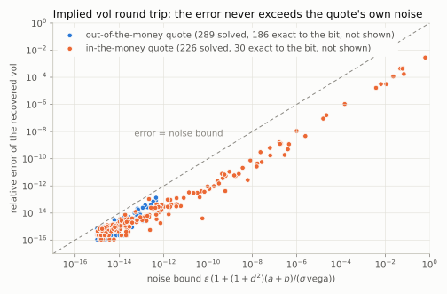
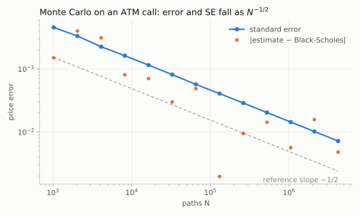
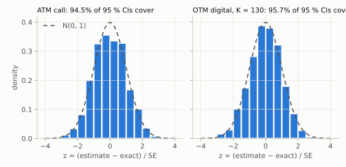
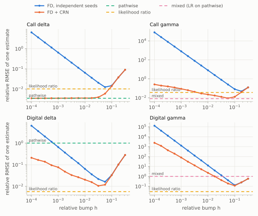
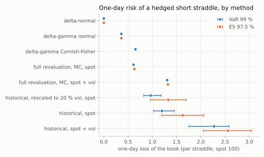
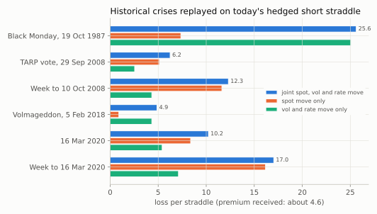

# RiskEngine-CPP — Numerical-method, risk-measure and model risk report

> **Status:** in progress. §2, §3 and §5 to §7 are written (Phases 1, 2 and 4 to 6). The other sections
> are filled in as the phases of the plan land ([`riskengine_research.md`](riskengine_research.md) §12).
>
> **Editorial rules.** Every figure has a self-contained caption (*what it shows*, then *why it
> matters*). Every number points to the CSV or test that produced it. Every stochastic estimate is
> given with its standard error. Every negative claim ("X fails") comes with its mechanism and its
> remedy.

## Executive summary

*To be written in Phase 8, once the quantified findings of §3 to §8 are established.*

---

## 1. Introduction and risk taxonomy

*To be written in Phase 8.* Framework: [`riskengine_research.md`](riskengine_research.md) §0.

---

## 2. Setup, conventions and reproducibility

### 2.1 Dynamics, reference parameters, unit conventions

Units (continuously compounded decimal rates, annualized decimal vol, maturities in years, raw
Greeks per unit of input) and the treatment of degenerate cases are fixed in
[`conventions.md`](conventions.md). The reference vector of this report is S = K = 100, r = 5 %,
q = 0, σ = 20 %, T = 1 year.

### 2.2 Protocol: generator, seeds, efficiency metric, regeneration

**Generator.** Philox 4×32-10, a counter-based generator: call *j* of block *b* is
Philox(key = seed, counter = (j, b, stream)), and its 128 bits give uniforms 2*j* and 2*j* + 1.
There is no state to share or advance. The
implementation is checked at compile time against the Random123 known-answer vectors. Uniforms
are the midpoints (k + ½)·2⁻⁵² of a 2⁵²-point grid: never 0 or 1, and 1 − u is exact. Normals
come from inversion (Wichura AS241, relative error ≤ 10⁻¹⁵ against a 60-digit reference), never
from `std::normal_distribution`, whose algorithm depends on the standard library, nor from
Box-Muller, which destroys the structure of quasi-random points. Because the grid is symmetric,
`normal(1 − u) == −normal(u)` exactly.

**Bit-for-bit reproducibility.** A simulation is cut into a fixed number of blocks, independent of
the thread count. Each block owns its random stream and its Welford accumulator; the partial
results are merged (Chan) in block order. Floating-point addition is not associative, so it is this
fixed order that makes the result bit-identical with 1, 2, 3, 8 or 64 threads. Automatic FMA
contraction is disabled (`-ffp-contract=off`), so GCC and Clang produce the same bits, including
with `-march=native`. So is compile-time evaluation of `exp`, `log`, `erfc` and `pow`
(`-fno-builtin-*`): GCC evaluates them on constants with correctly rounded arithmetic while the
run-time library may differ in the last ulp, so the bits of an expression depended on what the
optimizer happened to inline. This was caught when adding unrelated code to the engine moved the
exact Black-Scholes price recorded by an experiment in its 15th digit, and it changed the
rounding-dominated half of the V-curve of §3.2 (its figure and table are from the fixed build). A Monte Carlo estimate is therefore a pure function of (seed, number of
draws, number of blocks).

**Validation gates (Phase 2)**, all in `tests/test_rng.cpp` and `tests/test_simulation.cpp`, with
fixed seeds (deterministic tests):

| Gate | Result |
|---|---|
| Philox against the Random123 vectors | 3/3, checked by `static_assert` |
| Uniforms: mean, variance, Kolmogorov-Smirnov (10⁶ draws) | within 4 standard deviations; √n·D < 1.95 (99.9 % level) |
| Normals: mean, variance, skewness, kurtosis, Kolmogorov-Smirnov (10⁶ draws) | same |
| Serial (lag-1) and cross-block correlation | < 4/√n |
| Same result with 1/2/3/8/64 threads | exact equality |
| Same result on GCC and Clang | exact equality on golden values |
| Standard-error calibration, 200 independent replications | ≥ 90 % of \|z\| ≤ 1.96, no \|z\| > 4 |

**Efficiency.** Variance-reduction techniques will be compared by
efficiency = 1 / (variance × CPU time) (Glasserman), from Phase 4 on.

**Regeneration.** Every figure or table is produced by an executable in `experiments/`, which
writes `data/results/<id>.csv` and `<id>.meta.json`: git commit and dirty-tree flag, compiler,
configuration, flags, parameters, date. Committed results come from a Release build of a clean tree
(`"git_dirty": false`). Figures are rendered by `tools/make_figures.py`:

```
cmake -S . -B build-release -DCMAKE_BUILD_TYPE=Release
cmake --build build-release
for e in fd_vcurve iv_roundtrip mc_convergence mc_coverage mc_efficiency qmc_convergence \
         greeks_vs_h greeks_vs_n greeks_matrix var_straddle var_backtest stress_scenarios; do
  build-release/experiments/$e
done
python3 tools/make_figures.py        # pip install -r tools/requirements.txt
```

---

## 3. Ground truth: analytic Black-Scholes

Every method in the following sections (trees, Monte Carlo, stochastic Greeks) is judged against
the closed form. This section establishes that the closed form itself is exact to the precision
shown, and documents the two numerical limits it already imposes: inversion to implied volatility,
and finite differences.

### 3.1 Validation, invariants, implied volatility

**Reference values.** Ten cases (canonical vector, continuous dividend, Hull's example 15.6, and
two wing strikes whose out-of-the-money price is ~10⁻¹²) are compared with a 50-digit mpmath
reference ([`tools/bs_reference.py`](../tools/bs_reference.py)). The reference Greeks are
*numerical derivatives of the high-precision price*, not the closed forms, so they independently
check the formulas, their signs and the dividend handling. The price and all five Greeks agree to
10⁻⁹ relative in all ten cases, including the 10⁻¹² wing prices (`tests/test_black_scholes.cpp`).

| Canonical vector | Value |
|---|---|
| Call / put | 10.450584 / 5.573526 |
| Call delta | 0.636831 |
| Gamma | 0.018762 |
| Vega | 37.524 per 1.00 of vol (0.375 per point) |
| Call theta | −6.414 per year (−0.01757 per calendar day) |
| Call rho | 53.232 per 1.00 of rate |

**Invariants**, on a 315-point grid (strike 50 to 200 for S = 100, maturity 1 day to 5 years,
vol 5 % to 100 %): put-call parity to 10⁻¹⁴ relative to S + K; no-arbitrage bounds; ∂C/∂K < 0 and
convexity in strike; closed-form Greeks consistent with finite differences of the price. As T → 0
and σ → 0, the pricer returns the discounted forward intrinsic value through an explicit branch,
never through a division by zero; no NaN appears down to T = σ = 10⁻³⁰⁰.

**Implied volatility.** The solver maps the quote to the out-of-the-money option by parity, then
solves log price(σ) = log target with Brent's method on a bracket. Working in log price keeps the
problem well conditioned in the wings, where the price spans hundreds of orders of magnitude.
Newton alone is not used: it diverges where vega → 0.



*Figure 1 — Price → vol → price round trip on the 315-point grid, for the out-of-the-money (blue)
and in-the-money (orange) quote at each point. On the x-axis, the noise bound
ε·(1 + (1 + d²)(a + b)/(σ·vega)), where a − b is the price formula: the relative vol error that
the rounding of the quote causes on its own. **What it shows:** every point lies below the
diagonal; the solver's error never exceeds the noise in the quote, and the in-the-money degradation
tracks that noise exactly. **Why it matters:** an inaccurate implied vol taken from an
in-the-money quote is not a solver defect but information lost in the quote itself; no solver can
recover it.* Source: [`data/results/iv_roundtrip.csv`](../data/results/iv_roundtrip.csv).

| Quote | Solved | Max relative error | Above 10⁻⁹ | Max error / bound |
|---|---|---|---|---|
| Out of the money | 289 / 315 | 1.3 × 10⁻¹³ | 0 | 0.68 |
| In the money | 226 / 315 | 5.7 × 10⁻² | 19 | 0.64 |

The 26 unsolved out-of-the-money quotes have a price that underflows to zero (for example 1 day,
K/S = 2, σ = 5 %): there is no vol to recover. The 89 unsolved in-the-money quotes have a time
value below the rounding of their intrinsic value; the solver reports this (`ZeroTimeValue`)
instead of returning a number. The worst solved case, a put with K = 150, 3 months and σ = 10 %,
recovers the vol to within 5.7 %.

**Mechanism.** A Black-Scholes price is a difference a − b of two terms (for a call,
a = S e^{−qT} N(d₁) and b = K e^{−rT} N(d₂)). In the Gaussian tail the rounding of d is amplified
by a factor d, so each term carries a relative error of about ε·(1 + d²). The quote is therefore
only known to within ε·(1 + d²)·(a + b). Out of the money, a + b stays of the order of the price
and the vol is recovered to ~10⁻¹³. In the money, a + b ≈ S + K while the time value is tiny: the
loss reaches several percent.

**Remedy.** Always invert the out-of-the-money quote; an implied vol taken from a deep in-the-money
quote must come with its noise bound. Jäckel's formulation (*Let's Be Rational*, 2015) remains the
target for reducing the pricer's own share of the error in the wings.

### 3.2 Floating-point rounding and the finite-difference V-curve


*Figure 2 — Absolute error of central-difference delta and gamma on the Black-Scholes price
(canonical vector), against the closed form, for a relative bump h from 10⁻¹⁴ to 10⁻¹. Dashed lines
mark the theoretical optima ε^{1/3} (delta) and ε^{1/4} (gamma). **What it shows:** the error is
V-shaped; on the right, truncation falls as h²; on the left, price rounding grows as ε/h for delta
and ε/h² for gamma. **Why it matters:** a smaller bump does not make a Greek more accurate; below
the optimum it makes it wrong, and for gamma catastrophically so.*
Source: [`data/results/fd_vcurve.csv`](../data/results/fd_vcurve.csv).

In the rounding regime the error at any single h is a noisy draw (it changes sign and can cancel by
luck), so the table gives the median over the seven grid points within ±⅜ of a decade of each h.

| Relative bump h | Delta error | Gamma error (relative) |
|---|---|---|
| 10⁻³ | 8.6 × 10⁻⁷ | 1.2 × 10⁻⁶ |
| 10⁻⁴ | 8.6 × 10⁻⁹ | 2.4 × 10⁻⁸ |
| 10⁻⁵ | 8.1 × 10⁻¹¹ | 1.4 × 10⁻⁶ |
| 10⁻⁶ | 1.1 × 10⁻¹¹ | 1.1 × 10⁻⁴ |
| 10⁻⁸ | 2.0 × 10⁻⁹ | 130 % |
| 10⁻¹⁴ | 9.7 × 10⁻⁴ | 5.6 × 10¹¹ |

The delta error floor is about 10⁻¹¹ for h between 3 × 10⁻⁷ and ε^{1/3} ≈ 6 × 10⁻⁶; the gamma
floor is about 4 × 10⁻¹⁰ (2 × 10⁻⁸ relative) near h ≈ 5 × 10⁻⁵, just below ε^{1/4} ≈ 1.2 × 10⁻⁴.
Isolated downward spikes (for example 4 × 10⁻¹⁵ for delta at h = 2.4 × 10⁻⁶) are sign changes of
the error, not attainable accuracy. From h = 10⁻⁸ down, all 46 grid points give a gamma that is
100 % wrong or worse.

**Mechanism.** For the central difference, the truncation error is ~(h²S²/6)·∂³V/∂S³. The rounding
error is not ε·V: as in §3.1, the price is a difference a − b of two terms that each carry a relative
error of a few ε, so it is only known to ~ε·(a + b) ≈ 2.6 × 10⁻¹⁴ here (a + b ≈ 117 for a price of
10.45). The rounding error is therefore ~ε(a + b)/(hS) for delta and ~ε(a + b)/(hS)² for gamma, and
their sum with the truncation error is smallest at h* ∝ ε^{1/3} and ε^{1/4} respectively. At
h = 10⁻⁵ this predicts a gamma error of 2.6 × 10⁻¹⁴ / 10⁻⁶ ≈ 1.4 × 10⁻⁶ relative, which is what the
table shows. The experiment divides by the step actually realized in floating point, not the intended
one, so that the curve shows only the rounding of the price.

**Remedy.** Use a relative bump, never an absolute one, close to the optimum for the order of the
derivative. A relative bump of 10⁻⁴, a common choice, is safe for both Greeks on a deterministic
pricer. On a Monte Carlo pricer, statistical noise replaces rounding and moves the optimum by
several orders of magnitude: that is the subject of §6.

---

## 4. Trees: convergence and pathologies

*To be written in Phase 3.*

## 5. Monte Carlo: convergence and variance reduction

The engine (`methods/montecarlo/engine.hpp`) simulates any `PathModel` (GBM so far, with an exact
log-space step) for terminal and path-dependent payoffs, discounts, and returns an `Estimate` with its
standard error. Every experiment below uses the canonical market of §2.1 and its closed-form
prices as the truth. The engine's tests hold at 4 standard errors for calls, puts and digitals
with 1 and 12 time steps, and for the straddle and the geometric Asian with 12 steps
(`tests/test_monte_carlo.cpp`).

### 5.1 The N^{−1/2} rate and interval coverage



*Figure 3 — Monte Carlo price of the canonical ATM call with N = 2¹⁰ to 2²² paths (an independent
seed for each N): standard error and actual error against Black-Scholes. **What it shows:** the
standard error falls as N^{−1/2} (fitted slope −0.5004), and the actual error scatters below and
around it, within 1.55 standard errors at every N. **Why it matters:** the rate is the textbook one,
so any faster apparent convergence in later sections has to come from variance reduction, not luck.*
Source: [`data/results/mc_convergence.csv`](../data/results/mc_convergence.csv).

A slope proves the standard error has the right *rate*. It does not prove it has the right *size*.
For that, 1,000 independent pricings (10,000 paths each) of the ATM call and of an out-of-the-money
digital (K = 130) were compared with their exact prices.



*Figure 4 — z-scores (estimate − exact) / SE of 1,000 independent pricings, against the N(0, 1)
density. **What it shows:** 94.5 % (call) and 95.7 % (digital) of the 95 % confidence intervals
contain the exact price, against 95 % ± 0.69 % expected; the z-scores have standard deviation 1.04
and 1.00. **Why it matters:** the error bars reported with every Monte Carlo number in this report
are neither optimistic nor conservative, including for the skewed Bernoulli payoff of a digital.*
Source: [`data/results/mc_coverage.csv`](../data/results/mc_coverage.csv).

### 5.2 Efficiency table, failures included

Techniques are compared by **efficiency = 1 / (variance per path × CPU time per path)**, relative to
plain Monte Carlo on the same payoff. "Variance per path" charges each technique for every path it
simulates (an antithetic pair counts as two). Times are single-threaded, the minimum of three runs,
and include the pilot run that estimates the control-variate coefficient. 10⁶ paths per row.

| Payoff | Technique | Variance per path | ns per path | Efficiency vs plain |
|---|---|---|---|---|
| ATM call | plain | 215.8 | 39.6 | 1 |
| | antithetic | 108.0 | 27.1 | 2.9 |
| | S_T control | 31.5 | 40.1 | 6.8 |
| | antithetic + S_T control | 7.6 | 27.4 | **41** |
| Deep ITM call, K = 70 | plain | 397.4 | 26.3 | 1 |
| | antithetic | 23.1 | 17.8 | 25 |
| | S_T control | 0.98 | 30.1 | 355 |
| | antithetic + S_T control | 0.43 | 20.5 | **1,200** |
| Far OTM call, K = 160 | plain | 3.43 | 26.2 | 1 |
| | antithetic | 3.51 | 17.3 | 1.5 |
| | S_T control | 3.11 | 26.5 | **1.1** |
| ATM straddle | plain | 174.6 | 37.6 | 1 |
| | antithetic | 287.7 | 25.4 | **0.90** |
| Arithmetic Asian, ATM, 12 fixings | plain | 72.4 | 241.4 | 1 |
| | antithetic | 34.8 | 145.8 | 3.4 |
| | geometric control | 0.056 | 297.8 | **1,039** |
| | antithetic + geometric control | 0.061 | 189.4 | 1,511 |

Source: [`data/results/mc_efficiency.csv`](../data/results/mc_efficiency.csv) (timings on the CPU
recorded in its metadata; all estimates are within 2 standard errors of the exact price where one
exists).

**Antithetic variates** pair each path with its reflection Z → −Z. The variance per path becomes
σ²(1 + ρ), where ρ is the correlation between the two halves of a pair. For a payoff monotone in Z,
ρ < 0: the ATM call halves its variance, and the deep ITM call, which is almost linear in S_T, cuts it
17-fold. They also save time: a pair reuses its normals, and the inverse normal is the dominant cost.
**Where they fail:** the ATM straddle |S_T − K| is nearly even in Z, so ρ > 0 and the variance per path
*rises* by 65 %; only the cheaper draws keep the efficiency at 0.90. Far out of the money, almost no
path pays off in either half of a pair, ρ ≈ 0, and the only gain left is the saved draws (1.5×).

**Control variates** subtract β(X − E[X]) with β estimated on an independent pilot run. The variance
falls by a factor 1 − ρ²_YX. The terminal spot is an excellent control for a deep ITM call, which is
nearly S_T − K (355×). **Where it fails:** for the call struck at 160, the payoff is zero on most paths
where S_T varies most, the correlation collapses, and the variance falls by only 9 % (1.1×). The
geometric-average Asian, whose price is known in closed form, is so close to the arithmetic one
that the variance falls by a factor of 1,300 and the efficiency by more than 1,000 even after paying
for the pilot and the extra logarithms.

**Variance reduction beats parallelism.** On this 4-thread machine, perfect parallel scaling would
give at most 4×. The combined techniques give 41× on the ATM call and over 1,000× on the ITM call and
the Asian, from mathematics alone, and they compose with threading since the engine's result is
independent of the thread count.

*Timing note.* The plain ATM call costs 40 ns per path but the deep ITM and far OTM calls only
26 ns, for the same arithmetic: at the money, the branch in max(0, S_T − K) is a coin flip and
mispredicts half the time. This is why efficiencies are only compared within a payoff.

### 5.3 Randomized quasi-Monte Carlo

Quasi-Monte Carlo replaces pseudo-random points with a low-discrepancy sequence: here Sobol points
(Joe-Kuo direction numbers, checked bit for bit against SciPy) with hash-based Owen scrambling.
Scrambling keeps the net structure that makes the points accurate (tested: every one-dimensional
projection and the first two-dimensional one remain exact nets) while making each point uniformly
distributed, so each scrambling gives an unbiased estimate and independent scramblings give an
error bar. Path payoffs can be built by Brownian bridge, which spends the first, best-distributed
coordinates on the terminal value and then the coarse shape of the path.


*Figure 5 — Standard deviation of a single N-point estimate (over 64 independent seeds or
scramblings) against N, for four problems of increasing difficulty; each line is labeled with its
fitted slope. **What it shows:** pseudo-random Monte Carlo converges at N^{−1/2} everywhere;
randomized QMC reaches N^{−1} on the one-dimensional problems, including the digital, drops to
N^{−0.69} (N^{−0.80} with a bridge) on the 12-dimensional Asian, and barely beats N^{−1/2} on a digital of
the 12-dimensional average. **Why it matters:** QMC is not a free speed-up; its gain is set by the
smoothness and effective dimension of the payoff, and it collapses exactly where a risk system needs
it on exotic, discontinuous payoffs.* Source: [`data/results/qmc_convergence.csv`](../data/results/qmc_convergence.csv).

| Problem | Pseudo-random slope | RQMC slope | RQMC + bridge slope | Spread at N = 2¹⁶: pseudo-random → best RQMC |
|---|---|---|---|---|
| ATM call (1-D, kink) | −0.49 | −1.00 | — | 5.0 × 10⁻² → 1.4 × 10⁻⁴ (**344×**) |
| Digital, K = 130 (1-D, jump) | −0.50 | −1.00 | — | 1.0 × 10⁻³ → 6.6 × 10⁻⁶ (158×) |
| Arithmetic Asian, 12 fixings (12-D, kink) | −0.49 | −0.69 | −0.80 | 3.1 × 10⁻² → 4.2 × 10⁻⁴ (74×) |
| Digital on the 12-fixing average (12-D, jump) | −0.48 | −0.56 | −0.56 | 1.9 × 10⁻³ → 4.1 × 10⁻⁴ (**4.7×**) |

A spread 344 times smaller is worth 344² ≈ 118,000 times more pseudo-random paths. The randomized
QMC means agree with the pseudo-random ones (and with the closed forms where they exist) within
their error bars.

**Mechanism.** In one dimension a kink or a jump sits in a single interval of the stratification, so
only that interval contributes variance and the spread falls as N^{−1}, jump included: the textbook
statement that QMC fails on discontinuous payoffs is wrong in one dimension. In d dimensions a smooth
jump surface such as {average = K}, which is not aligned with the axes, cuts about N^{1−1/d} of the N
elementary boxes of the net, each contributing variance of order N^{−2}. The variance then falls only as
N^{−1−1/d}, a spread slope of −1/2 − 1/(2d) = −0.54 for d = 12, against −0.56 measured. The kinked
Asian sits in between: its difficulty is its effective dimension, which the Brownian bridge lowers
(−0.69 → −0.80, and a 4.3× smaller spread at N = 2¹⁶); for the digital the bridge helps the constant
(2.1×) but not the rate, because the jump surface stays oblique whatever the path construction.

**Remedy.** Use randomized QMC (never unscrambled points, which give no error bar) with a Brownian
bridge for smooth path payoffs; for discontinuous multi-dimensional payoffs, expect little more than
a constant factor and prefer smoothing the payoff (conditional expectation) or plain Monte Carlo with
a control variate.

## 6. Greek estimation under noise *(flagship section)*

A risk system needs Greeks from Monte Carlo prices, and every way of getting them trades bias,
variance and cost differently. Five estimators are compared (`methods/montecarlo/greeks.hpp`), on a
call (continuous, with a kink) and a cash-or-nothing digital (a jump), against the closed forms:

- **FD, independent seeds:** central differences of prices simulated with independent normals at
  S(1 ± h) (and S for gamma).
- **FD + CRN:** the same bumps on the same normal (common random numbers).
- **Pathwise:** the derivative of the discounted payoff along each path, e^{−rT} f′(S_T) S_T / S.
  An automatic-differentiation version (`Dual` numbers) reproduces it to 10⁻¹⁴.
- **Likelihood ratio (LR):** differentiates the density instead of the payoff: e^{−rT} f(S_T) × score.
- **Mixed (gamma only):** the likelihood ratio applied to the pathwise delta.

Every estimate carries an honest standard error, since each is an average of i.i.d. per-path terms.
Errors below are the RMSE of *one* estimate, √(bias² + spread²), measured over 32 independent
replications and relative to the exact Greek.

### 6.1 Why naive finite differences fail: the bias/variance trade-off



*Figure 6 — Relative RMSE of one estimate (N = 2¹⁶ paths) against the relative bump h, for finite
differences with independent seeds and with common random numbers; the unbiased estimators are
drawn as h-independent levels. **What it shows:** with independent seeds the error explodes as the
bump shrinks, as h⁻¹ for delta and h⁻² for gamma; common random numbers remove the explosion for
the call delta only. **Why it matters:** the bump that is safe on an analytic pricer (§3.2) is
catastrophic on a Monte Carlo one.* Source: [`data/results/greeks_vs_h.csv`](../data/results/greeks_vs_h.csv).

With independent seeds, the up and down prices each carry their own sampling noise, and the
difference divides it by 2hS: the variance of the delta estimator is O(1/(N h²)), of the gamma
estimator O(1/(N h⁴)). At h = 10⁻⁴, a bump that is harmless on the analytic pricer of §3.2, the
Monte Carlo delta is **6.4 times** its true value in error and the gamma **80,000 times**. Balancing
the h² bias against this variance gives h* ∝ N^{−1/6} and an RMSE falling only as N^{−1/3}
(measured −0.36, Figure 7). Even at its best bump (h ≈ 6 %), the independent-seed delta is 1.3 %
wrong at N = 2¹⁶, nearly four times the error of the pathwise estimator on the same paths.

**Remedy.** Never difference two independently simulated prices. At the very least use common
random numbers, and prefer an unbiased estimator (§6.3).

### 6.2 Common random numbers: what they fix and what they do not

With the same normal for every bump, a Lipschitz payoff (the call) gives per-path differences that
stay bounded as h → 0: the variance is O(1/N) whatever h, and the call delta is flat at 0.35 % for
every h ≤ 1 %. As h → 0, the CRN difference of each path *becomes* the pathwise derivative: the
two estimators are indistinguishable in Figures 6 and 7.

**Where CRN fail.** A second difference of a kinked payoff (the call gamma), or a first difference
of a jump (the digital delta), is non-zero only on the paths that end within about hS of the strike,
a fraction O(h) of them, where it is of size 1/h. The variance is then O(1/(N h)): the error grows
again as h shrinks (26 % for the call gamma and 21 % for the digital delta at h = 10⁻⁴), and the
best bump only achieves an RMSE falling as N^{−2/5}. For the digital gamma, a second difference of
a jump, the variance is O(1/(N h³)) and even with CRN the error is 2,400 times the gamma at
h = 10⁻⁴ and still 12 % at the best bump.

| Estimator (best bump for FD) | Measured RMSE slope in N | Theory |
|---|---|---|
| Call delta, FD independent | −0.36 | −1/3 |
| Call delta, FD + CRN; pathwise | −0.52; −0.53 | −1/2 |
| Call gamma, FD independent | −0.27 | −1/4 |
| Call gamma, FD + CRN | −0.43 | −2/5 |
| Digital delta, FD independent | −0.33 | −1/3 |
| Digital delta, FD + CRN | −0.40 | −2/5 |
| Digital gamma, FD + CRN | −0.26 | −2/7 |
| Likelihood ratio, mixed (where valid) | −0.46 to −0.51 | −1/2 |

Source: [`data/results/greeks_vs_n.csv`](../data/results/greeks_vs_n.csv) (slopes fitted from
N = 2¹⁰ to 2¹⁸).

### 6.3 Pathwise, likelihood ratio and mixed estimators; the silent failure on the digital


*Figure 7 — Relative RMSE of one estimate against N, with the best bump at each N for finite
differences; each line is labeled with its fitted slope. **What it shows:** the unbiased estimators
converge at N^{−1/2}, finite differences more slowly, and two estimators do not converge at all on
the digital: the pathwise delta and the mixed gamma sit at exactly 100 % error for every N.
**Why it matters:** those two failures come with a standard error of zero, so nothing in their
output warns the user.* Source: [`data/results/greeks_vs_n.csv`](../data/results/greeks_vs_n.csv).

**Pathwise** is the best delta for the call: unbiased, O(1/N) variance, one path per sample.
**The silent failure.** For a digital, f′ = 0 almost everywhere: every path contributes exactly 0,
so the pathwise delta is **0 with a standard error of 0**, while the true delta is 0.0188. The
estimator converges, with complete confidence, to the wrong answer. The mixed gamma inherits the
same flaw on the digital. The jump carries the whole derivative, and a pathwise derivative cannot
see a jump.

**Likelihood ratio** never differentiates the payoff, so it is unbiased for the digital too. It has
the best digital delta (0.57 %) and the only usable digital gamma (2.9 %). Its price is a higher
variance on smooth payoffs: on the call gamma, LR is 3.7 % wrong where the **mixed** estimator,
which differentiates the smooth part pathwise and only the kink by likelihood ratio, is 0.82 %
wrong, a 20-fold gain in efficiency at the same cost. The LR score grows as the maturity shrinks;
in relative terms the digital gamma degrades from 2.9 % at one year to 22 % at one week, while the
ATM call delta does not, because its payoff shrinks with √T as well.

### 6.4 Recommendation matrix

N = 2¹⁶ paths per estimate. Finite differences use a fixed relative bump of 1 %, a common desk
convention; "best" is the highest efficiency 1 / (MSE × time) in the row. Errors are relative RMSE.

| Greek | Regime | Best (efficiency) | Its error | FD + CRN, h = 1 % | FD independent, h = 1 % | Silent failure |
|---|---|---|---|---|---|---|
| call delta | ATM, T = 1 | pathwise | 0.35 % | 0.36 % | 6.4 % | — |
| call delta | K = 150, T = 1 | pathwise | 2.8 % | 2.7 % | 21 % | — |
| call delta | ATM, T = 1 week | pathwise | 0.35 % | 0.38 % | 0.94 % | — |
| call gamma | ATM, T = 1 | mixed | 0.82 % | 2.2 % | 797 % | — |
| call gamma | K = 150, T = 1 | mixed | 3.0 % | 6.6 % | 629 % | — |
| call gamma | ATM, T = 1 week | mixed | 0.59 % | 1.3 % | 12 % | — |
| digital delta | ATM, T = 1 | likelihood ratio | 0.57 % | 2.0 % | 6.4 % | pathwise (100 %) |
| digital delta | K = 150, T = 1 | likelihood ratio | 2.9 % | 5.3 % | 16 % | pathwise (100 %) |
| digital delta | ATM, T = 1 week | likelihood ratio | 0.56 % | 2.2 % | 2.3 % | pathwise (100 %) |
| digital gamma | ATM, T = 1 | likelihood ratio | 2.9 % | 229 % | 1,272 % | mixed (100 %) |
| digital gamma | K = 150, T = 1 | likelihood ratio | 3.2 % | 99 % | 684 % | mixed (100 %) |
| digital gamma | ATM, T = 1 week | likelihood ratio | 22 % | 82 % | 152 % | mixed (100 %) |

Source: [`data/results/greeks_matrix.csv`](../data/results/greeks_matrix.csv) (with bias, spread,
time per estimate and efficiency for every estimator; timings on the recorded CPU).

**Decision rule.** For a payoff that is Lipschitz in the underlying, use the pathwise delta and the
mixed gamma; finite differences with common random numbers are an acceptable delta (they tend to
pathwise), never a gamma. For a payoff with a jump, use the likelihood ratio for every Greek and
never a pathwise-based estimator, whose zero standard error is not evidence of accuracy. Never use
finite differences with independent seeds.

## 7. Risk measures on non-linear positions

One book is used throughout: **short one 30-day at-the-money straddle (call + put, K = 100),
delta-hedged with the underlying** (`delta_hedged_short_straddle` in `risk/portfolio.hpp`), at
S = 100, r = 5 %, q = 0, σ = 20 %. It is the textbook short-volatility position, the one a
linear risk model gets most wrong: its delta is 0, its gamma −0.138, its vega −0.228 per vol point
and its theta +0.11 per trading day, for a premium received of about 4.6. The horizon is one trading
day, 1/252 of a year, for the diffusion and the time decay alike ([`conventions.md`](conventions.md)).
VaR is at 99 % and ES at 97.5 % (the FRTB pair); the empirical estimators use the ⌈αN⌉-th order
statistic and the mean of the tail from it upwards (`risk/var.hpp`). Every empirical figure carries
a 95 % percentile-bootstrap interval (200 resamples).



*Figure 8 — One-day 99 % VaR and 97.5 % ES of the hedged short straddle, by method and set of risk
factors, with 95 % bootstrap intervals for the empirical methods. **What it shows:** the linear
method reports no risk at all, the quadratic one 59 % of the spot-only full revaluation, and adding
the volatility factor or real (fat-tailed) history doubles the full-revaluation figure again. **Why
it matters:** on an option book, the choice of method moves the 99 % VaR from 0 to 2.3 (half the
premium received) before any parameter is estimated.* Source: [`data/results/var_straddle.csv`](../data/results/var_straddle.csv).

| Method | Risk factors | VaR 99 % [95 % CI] | ES 97.5 % [95 % CI] |
|---|---|---|---|
| Delta-normal | spot | 0 | 0 |
| Delta-gamma, normal | spot | 0.361 | 0.363 |
| Delta-gamma, Cornish-Fisher | spot | 0.652 | — |
| Full revaluation, Monte Carlo (10⁶ scenarios) | spot | 0.613 [0.609, 0.616] | 0.631 [0.627, 0.634] |
| Full revaluation, Monte Carlo | spot + vol | 1.306 [1.301, 1.313] | 1.321 [1.317, 1.326] |
| Historical, 2,520 days to 2026-09-22 | spot | 1.200 [1.025, 1.457] | 1.625 [1.193, 2.061] |
| Historical | spot + vol | 2.274 [1.756, 2.581] | 2.555 [2.051, 3.041] |
| Historical, returns rescaled to 20 % vol | spot | 0.967 [0.821, 1.180] | 1.329 [0.961, 1.700] |

### 7.1 Delta-normal: blind by construction

A delta-hedged book has no first-order exposure, so the delta-normal loss is identically zero and
so are its VaR and ES, at every confidence level (`tests/test_portfolio_risk.cpp`, "Delta-normal
VaR of a delta-hedged book is zero"). This is not an estimation error that more data would reduce:
the method cannot represent the risk of the position. In the backtest of §7.4 it is exceeded on
**40.2 %** of days, which is exactly the fraction of days on which the book lost money.

**Remedy.** Never use a linear risk measure on a book whose Greeks beyond delta are material; a
book that is flat in delta is the case where it matters most.

### 7.2 Delta-gamma: the right moments, the wrong shape

The second-order loss of the book over the horizon is L ≈ −Θ Δt − ½ Γ S² σ² Δt Z², with Z
standard normal: with Γ < 0 and Θ > 0 it is a **shifted χ² with one degree of freedom**, scaled by
c = ½ |Γ| S² σ² Δt = 0.110. Its mean is almost exactly zero (the theta earned pays for the expected
gamma loss) but its skewness is 2√2 ≈ 2.8 and its excess kurtosis 12. The loss moments are
computed exactly (`risk/approximations.hpp`; all four moments checked against 2 × 10⁶ simulated losses in
`tests/test_portfolio_risk.cpp`); the trouble is what is done with them.

- **Delta-gamma normal** matches the mean and variance and assumes a normal shape: VaR =
  2.326 × c√2 = **0.361, 41 % below** the full-revaluation 0.613. The χ² quantile it should use is
  c (χ²₁,₀.₉₉ − 1) = 5.63 c = 0.619, which reproduces the Monte Carlo value to 1 %: the whole gap is
  the shape of the distribution, not the Taylor expansion.
- **Delta-gamma Cornish-Fisher** corrects the quantile with the skewness and kurtosis: 0.652, now
  **6 % above** the truth. The expansion is a series in the higher cumulants, and at a skewness of
  2.8 and a kurtosis of 15 it is well outside the range where it converges; here it happens to err
  on the conservative side.
- The normal ES is useless for the same reason: 0.363 against 0.631, since a normal tail beyond the
  VaR is thin by construction.

**Remedy.** For a book dominated by gamma, use full revaluation; if an analytic figure is needed,
use the exact quantile of the quadratic form (here a χ², in general a weighted sum of χ² computed
by Fourier inversion), not a moment-matched normal.

### 7.3 Full revaluation: risk factors, fat tails, ES and subadditivity

Full revaluation reprices the book in every scenario (Black-Scholes at the shocked spot and vol,
with one day of decay) and is exact up to the scenario generator. What remains is the choice of
the generator, and it dominates the result:

- **The volatility factor doubles the risk.** Monte Carlo with GBM spot moves only gives 0.613.
  Adding a daily implied-vol shock calibrated on the last ten years of VIX changes (standard
  deviation 1.97 vol points, correlation −0.75 with the NASDAQ return) gives **1.306**: a short
  straddle is short vega as much as short gamma, and the vol rises precisely when the spot falls. A
  spot-only VaR, however accurate, measures half of the risk.
- **History is fatter-tailed than GBM.** Historical simulation on the NASDAQ over the same ten
  years gives 1.200 for spot alone. Part of the gap is the level of vol (22.2 % realized against the
  20 % of the other methods); rescaling the returns to 20 % leaves **0.967, still 58 % above the
  GBM figure**, and that remainder is the shape of the tails. With the observed vol changes as well,
  historical VaR reaches 2.274.
- **ES sees the tail that VaR ignores.** Under GBM the 97.5 % ES exceeds the 99 % VaR by 3 % (for a
  normal the two agree within 1 %); on history, by 35 % (1.625 against 1.200). The ratio ES/VaR is itself a
  tail diagnostic.
- **Sampling error is not uniform.** With 10⁶ Monte Carlo scenarios the bootstrap interval is
  ±0.6 %; the 1 % tail of 2,520 historical days is 25 observations, and the interval is −15 % to
  +21 % for the VaR and ±27 % for the ES. A historical ES is a noisy number and must be reported
  with its interval.

**Subadditivity.** ES is a coherent risk measure and VaR is not. The engine checks the classic
counterexample (Artzner et al. 1999) in `tests/test_var.cpp`: two independent bonds each losing 100
with probability 4 % have a 95 % VaR of 0 each, but 100 together. Diversification increases VaR,
while the ES of the pair (103.2) stays below the sum of the stand-alone ES (79.8 + 79.8).

**Remedy.** Revalue fully, include every risk factor to which the book has a first-order Greek
(here vol, not only spot), prefer ES with a bootstrap interval, and compare model scenarios with
historical ones: their disagreement measures the model risk of the generator.

### 7.4 Backtesting on thirty-four years of data

Every trading day t from 24 December 1991 to 21 September 2026 (8,744 days), a fresh book is set up:
short a 30-day ATM straddle, delta-hedged, spot normalized to 100, vol = VIX_t, rate = 3-month
T-bill as of t. Its one-day 99 % VaR is forecast by four methods, and the realized loss is the full
revaluation at t + 1 with the NASDAQ Composite move, VIX_{t+1}, the new rate and one day of decay.
Monte Carlo uses GBM at the day's implied vol (spot only, 20,000 scenarios, the same every day);
historical simulation uses the previous 500 days of NASDAQ returns and VIX changes. The data are
frozen FRED series with checksums (`data/raw/manifest.json`, [`conventions.md`](conventions.md)).
The tests are Kupiec's proportion of failures (POF), Christoffersen's independence test and the
Basel traffic light on non-overlapping 250-day windows (`risk/backtest.hpp`, checked against
independent reference values in `tests/test_backtest.cpp`). 87.4 exceptions are expected.

| Method | Mean VaR | Exceptions | Rate | Kupiec p | Christoffersen p | Red-zone windows | 2008 / 2020 crisis |
|---|---|---|---|---|---|---|---|
| Delta-normal | 0 | 3,511 | 40.2 % | 0 | 0.071 | 34 / 34 | 62 / 24 |
| Delta-gamma normal | 0.350 | 1,109 | 12.7 % | 0 | 0.12 | 34 / 34 | 28 / 13 |
| Monte Carlo full revaluation (spot) | 0.598 | 588 | 6.7 % | 5 × 10⁻²⁷⁸ | 0.16 | 29 / 34 | 17 / 9 |
| Historical full revaluation (spot + vol) | 1.783 | 118 | 1.35 % | 0.0018 | 3 × 10⁻⁵ | 2 / 34 | 14 / 7 |

Crisis windows: 1 September 2008 to 31 March 2009 and 15 February to 30 April 2020. Source:
[`data/results/var_backtest_summary.csv`](../data/results/var_backtest_summary.csv); daily series in
[`data/results/var_backtest.csv`](../data/results/var_backtest.csv).


*Figure 9 — Realized one-day loss of the fresh hedged short straddle against its Monte Carlo
(spot) and historical (spot + vol) 99 % VaR, through the 2008 crisis and the 2020 pandemic; dots
mark the exceptions of the historical VaR. **What it shows:** the Monte Carlo VaR reacts at once to
the implied vol but misses the vol spikes; the historical VaR is high on average but rises only
after a crisis has entered its window, and stays high for two years after it. **Why it matters:**
passing a coverage test on average does not protect against the days that matter.* Source:
[`data/results/var_backtest.csv`](../data/results/var_backtest.csv).

- **The model-based methods fail coverage outright.** Delta-normal and delta-gamma are in the red
  zone in every one of the 34 non-overlapping windows of 250 trading days. Monte Carlo on spot alone
  is exceeded 6.7 % of the time, almost seven times the nominal rate, and **95 % of its exceptions fall on days when the VIX rose**, against
  46 % of all days: the missing risk is the vega of §7.3, not the gamma, which it prices exactly.
  Its exceptions are nevertheless close to independent (p = 0.16), because the forecast follows
  the implied vol day by day.
- **Historical simulation passes on average and fails in time.** It is exceeded 118 times against
  87 expected: only 2 of the 34 windows are red, but Kupiec still rejects at the 1 % level, and
  Christoffersen rejects independence strongly (p = 3 × 10⁻⁵). The exceptions cluster: 14 in the
  seven months of the 2008 crisis and 7 in ten weeks of 2020, when a well-calibrated 99 % VaR would
  have given one or two. A 500-day window carries a crisis only once it has happened, and carries
  it for two years afterwards (Figure 9, 2009 and late 2020): the average VaR is three times the
  Monte Carlo one, at the wrong times.

**Remedy.** Backtest coverage *and* independence; a model that passes Kupiec but fails
Christoffersen is late, not right. Add the vol factor to model-based VaR, and weight recent history
more (filtered historical simulation, volatility-scaled returns) so that a historical VaR reacts at
the start of a crisis rather than after it.

### 7.5 Stress testing

Historical crises ([`riskengine_research.md`](riskengine_research.md) §9.2) are replayed on
today's book of §7.1–7.3 (σ = 20 %, r = 5 %): each is a joint close-to-close move of the NASDAQ
Composite, of implied vol (VIX; VXO for 1987, before the VIX existed) and of the 3-month T-bill
yield, with the decay of its trading days. The loss is also computed with the spot move alone and
with the vol and rate moves alone.

| Scenario | Dates (close to close) | NASDAQ | Implied vol | Loss | Spot only | Vol and rate only |
|---|---|---|---|---|---|---|
| Black Monday | 16–19 Oct 1987 | −11.4 % | +113.8 pts | **25.6** | 7.4 | 25.1 |
| TARP vote | 26–29 Sep 2008 | −9.1 % | +12.0 pts | **6.2** | 5.1 | 2.6 |
| Week to 10 Oct 2008 | 3–10 Oct 2008 | −15.3 % | +24.8 pts | **12.3** | 11.6 | 4.3 |
| Volmageddon | 2–5 Feb 2018 | −3.8 % | +20.0 pts | **4.9** | 0.9 | 4.3 |
| COVID Monday | 13–16 Mar 2020 | −12.3 % | +24.9 pts | **10.2** | 8.4 | 5.4 |
| Week to 16 Mar 2020 | 6–16 Mar 2020 | −19.5 % | +40.7 pts | **17.0** | 16.2 | 7.1 |

NASDAQ moves are simple returns (the CSV stores log-returns). Source:
[`data/results/stress_scenarios.csv`](../data/results/stress_scenarios.csv).



*Figure 10 — Loss of the hedged short straddle in six historical crises, for the joint move and for
the spot and vol moves alone. **What it shows:** a single day can cost from one to five and a half
times the premium received, and the factor that drives the loss changes from crisis to crisis.
**Why it matters:** these losses are 2 to 11 times the historical 99 % VaR and 4 to 20 times the
Monte Carlo one; no one-day VaR, however well backtested, describes them.* Source:
[`data/results/stress_scenarios.csv`](../data/results/stress_scenarios.csv).

- **The loss is not always where a spot-only model looks.** Black Monday is almost entirely a vol
  loss (25.1 of 25.6), because the VXO more than doubled; Volmageddon, a 3.8 % fall, cost 4.9, of
  which the spot move alone explains 0.9. In the long crashes of 2008 and 2020 the spot move
  dominates.
- **The factors do not add up.** Spot-only plus vol-only differs from the joint loss (7.4 + 25.1
  against 25.6 in 1987; 0.9 + 4.3 against 4.9 in 2018): the vega of an option depends on the spot
  and its gamma on the vol, so scenarios must be applied jointly, never summed factor by factor.
- **Stress losses dwarf VaR.** The 1987 loss is 11 times the historical spot-and-vol VaR of §7.3
  and 20 times the Monte Carlo one; the spot move of 1987 alone is 12 times the spot-only Monte
  Carlo VaR.

**Remedy.** Complement VaR and ES with joint historical stress scenarios that shock every risk
factor of the book, and read the factor split to see which Greek the loss comes from.

## 8. Model risk beyond GBM

*Phase 7, optional ([`riskengine_research.md`](riskengine_research.md) §12.1).*

## 9. Engineering and performance notes

*To be written in Phase 8.*

## 10. Limitations and future work

*To be written in Phase 8.*

## 11. Conclusion: operational recommendations

*To be written in Phase 8.*

---

## Appendices

*A. derivations of the pathwise and LR estimators; B. parameter tables; C. reference values and
sources; D. reproduction procedure (see §2.2 for the current state).*
