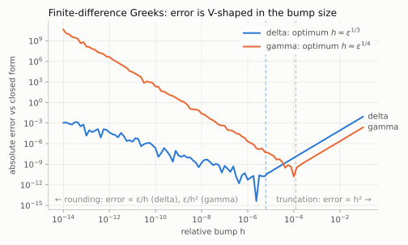
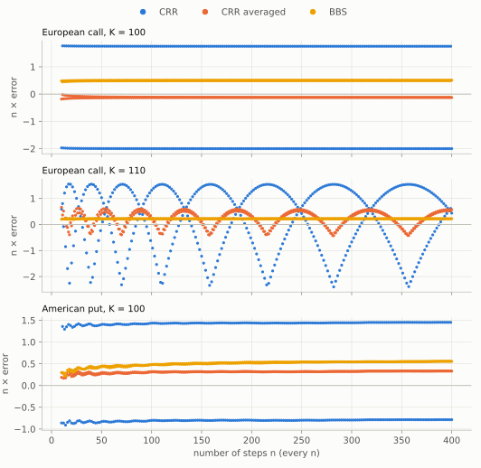
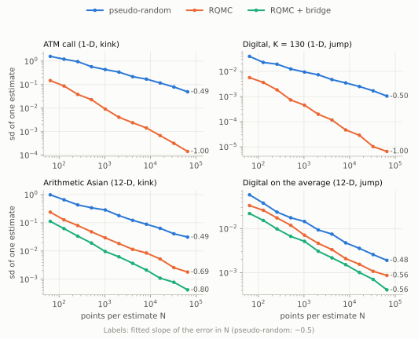
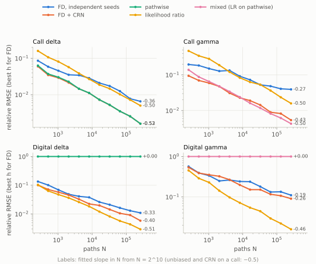
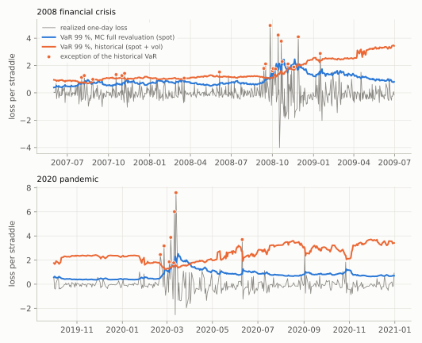
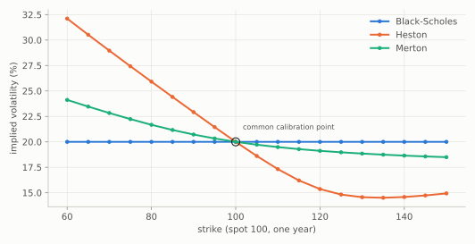
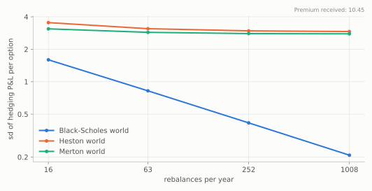

# RiskEngine-CPP — Project showcase

A C++20 pricing and risk engine built to answer one question: **when a pricing or risk number is
wrong, how wrong is it, why, and how would you know?**

It prices options three ways under one model (Black-Scholes closed form, binomial trees, Monte
Carlo), estimates Greeks five ways, measures risk seven ways on a real historical backtest, then
changes the model itself (Heston, Merton) to measure model risk. Every number in the write-up is
produced by a committed experiment, regenerated by one command, and reproduced bit for bit.

- **The report:** [`model_risk_report.md`](model_risk_report.md) (16 figures, 11 sections, 4
  appendices).
- **The conventions:** [`conventions.md`](conventions.md).

---

## At a glance

| | |
|---|---|
| Language, build | C++20, header-only library, CMake ≥ 3.25; GCC, Clang, MSVC |
| Library | 37 headers under `include/riskengine/`, ~3,700 lines |
| Tests | 98 Catch2 test cases, run by CI on GCC, Clang, MSVC and under ASan/UBSan |
| Experiments | 17 executables → 20 result tables (`data/results/*.csv` + metadata) → 15 figures |
| Benchmarks | Google Benchmark suite, results in `data/results/bench.json` |
| Reproducibility | `cmake --build <dir> --target report` regenerates everything in ~5 min, bit-identical except timings |
| Market data | NASDAQ, VIX, VXO, 3-month T-bill from FRED, frozen with SHA-256 checksums |
| History | 9 merged pull requests covering every phase of the build (0 to 8) |

---

## Architecture

```
include/riskengine/
├── concepts.hpp            Pricer, StochasticPricer, PathModel, ParametrizedModel, payoff concepts
├── core/                   units (strong typedefs), market, Estimate, normal CDF, quadrature
│   ├── rng/                Philox 4x32-10, AS241 inverse normal, Sobol (Joe-Kuo), Owen scrambling
│   ├── stats/              Welford / Chan accumulators, covariance
│   └── simulation.hpp      fixed-block parallel reduction (thread-count invariant)
├── methods/
│   ├── analytic/           Black-Scholes-Merton + Greeks, implied vol, digital, geometric Asian
│   ├── tree/               CRR, averaged CRR, Leisen-Reimer, BBS, BBS-Richardson; American; node Greeks
│   └── montecarlo/         generic engine, antithetic, control variates, RQMC, Brownian bridge,
│                           Greek estimators (FD, CRN, pathwise, likelihood ratio, mixed)
├── models/                 GBM, Heston (characteristic function, QE, Euler), Merton (series, exact)
├── payoffs/                vanilla, digital, arithmetic and geometric Asian
├── greeks/                 Greeks struct, forward-mode automatic differentiation (Dual)
├── risk/                   VaR/ES + bootstrap, portfolio, delta-normal / delta-gamma, backtests
└── io/                     FRED time-series reader (validated), alignment, returns
```

**Design principles**
- **Concepts, not inheritance.** No virtual dispatch in the hot path, and a model or payoff
  lacking the required interface is rejected at compile time.
- **Every stochastic number carries its error.** A Monte Carlo price is an `Estimate` (value,
  standard error, discretization bias, sample count), never a bare `double`.
- **A stochastic pricer is a pure function of (market, seed).** Common random numbers come for
  free, and results never depend on the thread count: the work is cut into fixed blocks merged in
  order.
- **Reproducible floating point.** No `-ffast-math`, no FMA contraction, no compile-time libm
  folding. Results are bit-identical on GCC and Clang.
- **Experiments own the numbers.** Each writes a CSV and a metadata file (git commit, dirty flag,
  compiler, flags, CPU, parameters). Committed results come from clean trees only.

---

## What was built, phase by phase

### Phase 0–1 — Scaffold and analytic ground truth

What was built:
- Black-Scholes-Merton with continuous dividend yield and closed-form Greeks, checked against a
  50-digit mpmath reference (10⁻⁹ relative, including 10⁻¹² wing prices).
- Put-call parity to 10⁻¹⁴, and no NaN down to T = σ = 10⁻³⁰⁰.
- An implied-vol solver (Brent on the log of the out-of-the-money price) that recovers the vol to
  10⁻¹³ from out-of-the-money quotes.

What it showed:
- **An in-the-money quote cannot pin its implied vol.** The loss (up to 5.7 %) tracks a
  rounding-noise bound derived in the report exactly; the solver is not at fault.
- **A finite-difference gamma is 100 % wrong for any bump below 10⁻⁸.** It is the classic V-curve,
  with the rounding term derived from the structure of the price.



### Phase 2 — Stochastic infrastructure

- **Random numbers.**
  - Philox 4×32-10, checked at compile time against the Random123 vectors.
  - Uniforms on a symmetric midpoint grid, so 1 − u is exact.
  - The Wichura AS241 inverse normal, accurate to 10⁻¹⁵ against a 60-digit reference.
- **Parallel reduction.** Fixed-block reduction that is **bit-identical for 1, 2, 3, 8 or 64
  threads and on GCC and Clang**.
- **Experiment harness.** Every figure traces back to a CSV, and every CSV to a commit.

### Phase 3 — Binomial trees

- **Five tree methods**, European and American. Delta, gamma and theta are read off an extended
  tree rooted two steps before today.
- **CRR's error flips sign between even and odd n** (−2.00/n against +1.75/n at the money).
  Sampling only even n would hide half of the behaviour.
- **Leisen-Reimer is the only second-order method:** 3.6 × 10⁻⁹ at n = 10,000.
- **New finding:** BBS-Richardson is second order *only for n divisible by 4*, because the BBS
  error constant differs between even and odd n. Early exercise brings every method back to first
  order.
- **Reference checks:** the published tree values are reproduced (American put 6.090333 at
  n = 20,000), and an American call without dividends equals the European call bit for bit.
- **Extension: Longstaff-Schwartz.** The same American put priced by least-squares Monte Carlo
  instead of a lattice, split-sample so the regression's own look-ahead never leaks into the
  reported price, lands within 0.7 standard errors of the tree. The regression's bias does not
  shrink with more paths — only the standard error does — so the two are reported separately
  (`model_risk_report.md` §4.4).



### Phase 4 — Monte Carlo and variance reduction

- **A generic engine** over any `PathModel`, for terminal and path payoffs.
- **Honest error bars.** The engine's 95 % intervals cover the true price 94.5–95.7 % of the time
  over 1,000 pricings.
- **Variance reduction is judged by efficiency** (1 / variance × time), with its failures shown.
  - Antithetic *hurts* a straddle (efficiency 0.90).
  - A spot control collapses far out of the money (1.1×).
  - Combined techniques reach 41× on an at-the-money call and over 1,000× on in-the-money calls
    and Asians.
- **Randomized QMC** (Sobol + Owen scrambling + Brownian bridge) cuts the error of a single
  estimate 344× in one dimension, but only 4.7× on a digital of a 12-date average. The report
  derives why from the geometry of the jump surface.



### Phase 5 — Greeks under noise (the flagship)

- **Five estimators** — finite differences with independent seeds, finite differences with common
  random numbers, pathwise (cross-checked by automatic differentiation), likelihood ratio and
  mixed — compared on a call and a digital.
- **The silent failure.** The pathwise delta of a digital converges *with a standard error of
  zero* to 0, against a true delta of 0.0188. Nothing in its output warns you.
- **Independent-seed finite differences** at h = 10⁻⁴ are 6.4× wrong on delta and 80,000× on
  gamma.
- **Measured convergence rates match theory** (e.g. −0.40 against −2/5 for the CRN digital delta).
- **A recommendation matrix** gives the best estimator for every payoff × regime × Greek.



### Phase 6 — Risk measures on non-linear positions

The book is a delta-hedged short straddle. Its one-day 99 % VaR by method:

| Method | VaR 99 % |
|---|---|
| Delta-normal | **0** (blind by construction) |
| Delta-gamma normal | 0.361 (41 % short: a χ² shape forced into a normal) |
| Full revaluation, spot only | 0.613 [0.609, 0.616] |
| Full revaluation, spot + implied vol | 1.306 [1.301, 1.313] |
| Historical, spot + vol | 2.274 [1.756, 2.581] |

- **A 34-year backtest** (8,744 days, frozen FRED data):
  - the model-based methods are in the Basel red zone in every 250-day window;
  - historical simulation passes coverage on average, but its exceptions cluster in crises
    (Christoffersen p = 3 × 10⁻⁵).
- **Replayed crises** (1987, 2008, 2018, 2020) cost up to 11× the historical VaR. 1987 was almost
  entirely a volatility loss.



### Phase 7 — Model risk (Heston, Merton)

- **Two new models.**
  - Heston: characteristic function in the "little trap" form, plus Andersen's QE and
    full-truncation Euler simulation.
  - Merton: Poisson series and exact simulation.
  - Both are checked against 30-digit references; Andersen's published 13.0847 is reproduced.
- **Same at-the-money price, different exotics.** Against Black-Scholes, all calibrated to the
  same at-the-money call, Heston prices:
  - the 80 put **+146 %**;
  - an up-and-out barrier **+108 %**;
  - the digital +20 %;
  - the monthly Asian +2 %.
- **Hedging in the wrong world.** A Black-Scholes delta hedge's error halves with every 4× in
  rebalancing frequency in its own world. Under Heston and Merton it stalls at 2.8–2.9 per option;
  the 99 % ES of the loss is 12–15, more than the premium.
- **Bias the error bar can't see.** With Feller's condition violated, Euler at 320 steps is still
  **27 standard errors** off at the money and 15 % off at K = 140. QE is within about 2 from 80
  steps.





### Phase 8 — Performance and write-up

| Operation | Median | Plan target |
|---|---|---|
| Black-Scholes price (+ Greeks) | 34 ns (36 ns) | < 100 ns ✓ |
| Tree, n = 1,000 (European / American) | 0.15 ms / 0.52 ms | < 5 ms ✓ |
| Monte Carlo, 1M paths, one thread | 38.6 ms | < 20 ms ✗ (normals are 39 % of a path) |
| Parallel efficiency, 4 threads | 93 % | — |

Two pathologies were found by measuring and are documented in the report:
- **Subnormal numbers** made the n = 10,000 tree 9× slower than its O(n²) cost. Flushing them made
  it 9× faster, with bit-identical results.
- **False sharing** makes adjacent atomic counters 20× slower than padded ones. The engine avoids
  it by construction.

---

## Engineering quality

**Independent references everywhere**
- mpmath at 30–60 digits for Black-Scholes, the inverse normal, Heston and Merton.
- SciPy for the Sobol directions, the normal VaR/ES table and the backtest statistics.
- Random123 vectors for Philox.
- Published values: Andersen's case I, and the CRR tree values at n = 20,000.

**Mutation checks.** Key formulas were deliberately broken to confirm the tests catch it: the
Leisen-Reimer inversion, the QE drift, the Merton compensator, the delta-gamma fourth moment.

**Bugs found and fixed along the way** (each documented in a commit or in the report):
- **Build:** GCC constant-folding `exp`/`log` at compile time changed results in the last ulp.
  Fixed with `-fno-builtin-*`.
- **Library:**
  - Sobol undefined behaviour at index 2³² − 1.
  - A randomized-QMC sample limit.
  - A Greek estimator silently mislabelled on unsupported pairs, now rejected in every build.
  - A delta-gamma fourth-moment coefficient (12 → 48).
  - A Merton series that never stopped when jumps are rare (1 − mass rounding).
- **Data input:** a data reader that accepted impossible dates and `nan`.
- **Benchmarks:**
  - A benchmark miscompiled by Google Benchmark's `DoNotOptimize` under GCC 13.
  - A false-sharing study hidden by store-to-load forwarding.
- **Experiment design:**
  - A shared seed that made noise look like bias.
  - A hedging grid whose last interval was mis-accrued.

**Reproducibility, demonstrated rather than claimed.** A full regeneration reproduces every
committed CSV and SVG bit for bit, except the timing columns.

---

## Try it

```bash
git clone https://github.com/Rayyan-Oumlil/RiskEngine-CPP.git && cd RiskEngine-CPP

# Build and test (GCC, Clang or MSVC; CMake ≥ 3.25)
cmake -S . -B build -DCMAKE_BUILD_TYPE=Release
cmake --build build --parallel
ctest --test-dir build --output-on-failure

# A tour of the library in one program
build/examples/quickstart

# Regenerate every result and figure of the report (Python: pip install -r tools/requirements.txt)
cmake --build build --target report

# Benchmarks
cmake -S . -B build-bench -DCMAKE_BUILD_TYPE=Release -DRISKENGINE_BUILD_BENCH=ON
cmake --build build-bench --target riskengine_bench && build-bench/bench/riskengine_bench
```

`build/examples/quickstart` prints (Release, GCC):

```
Black-Scholes        10.450584   delta 0.6368  gamma 0.0188  vega/pt 0.3752
Implied vol          0.200000000000 (ok)
CRR, n = 1000        10.448584   error -2.00e-03
Leisen-Reimer, 1001  10.450583   error -3.54e-07
American put (BBS-R) 6.090397   European put 5.573526
American put (LSM)   6.004062 ± 0.027926  (bias estimate -0.0008)
Monte Carlo (anti.)  10.439233 ± 0.010149  (-1.1 standard errors from BS)
Pathwise delta       0.6369 ± 0.0011  (exact 0.6368)
Heston (CF)          10.394219
Merton (series)      11.393999
```

Using the library takes a header and a few lines:

```cpp
#include "riskengine/methods/montecarlo/engine.hpp"
#include "riskengine/models/heston.hpp"
using namespace riskengine;

const MarketState m{Spot{100}, Rate{0.05}, Rate{0.0}, Vol{0.0}};          // Heston ignores Vol
const MonteCarlo<HestonQE, VanillaPayoff> mc(VanillaPayoff{100.0, OptionType::Call}, Maturity{1.0},
                                             MonteCarloConfig{.paths = 1u << 20, .steps = 64, .threads = 4},
                                             HestonParams{0.04, 2.0, 0.04, 0.3, -0.7});
const Estimate e = mc.price(m, SeedKey{2026});     // e.value, e.std_error; same bits on any thread count
```

---

## Repository map

| Path | Contents |
|---|---|
| `include/riskengine/` | the library (header-only) |
| `tests/` | 98 Catch2 test cases, with independent reference values |
| `experiments/` | one executable per figure or table of the report, plus the harness |
| `data/raw/` | frozen FRED series and their manifest (SHA-256) |
| `data/results/` | every committed result, with its metadata |
| `docs/` | report, conventions, figures, this showcase |
| `tools/` | reference generators (mpmath), data fetcher, figure renderer |
| `bench/` | Google Benchmark suite |
| `examples/` | the quickstart program |

---

## Limitations, stated plainly

- **Model scope.**
  - Heston and Merton are calibrated to one at-the-money price, not to a market smile.
  - No local volatility, no stochastic rates, no discrete dividends.
- **Risk-measure scope.** The risk study covers one book (a hedged straddle) on one index, with the
  VIX as the implied-vol proxy.
- **Timings.** They come from one 4-vCPU virtual machine. Monte Carlo misses its
  single-thread target by 2×.
- **Missing methods.**
  - Longstaff-Schwartz only for a vanilla put or call under GBM (no Heston, no path-dependent
    payoff).
  - No adjoint AAD.
  - No barrier continuity correction.
  - No hypothetical or reverse stress tests.

The report's §10 lists these in full, and §11 turns the findings into 16 operational rules.
